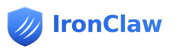
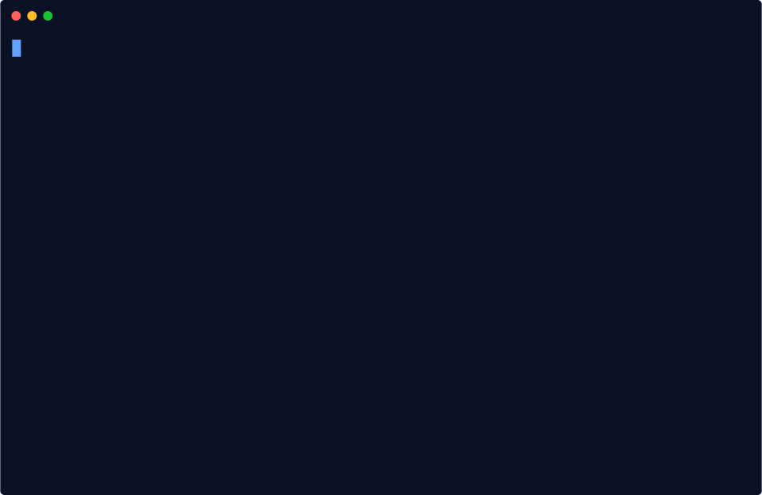
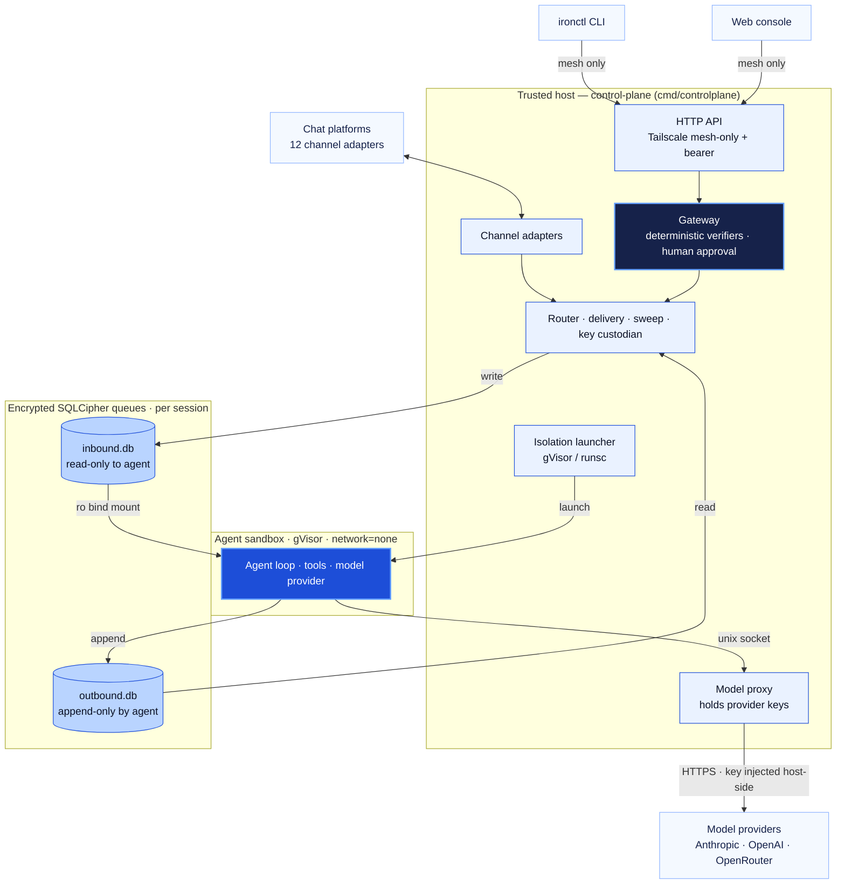
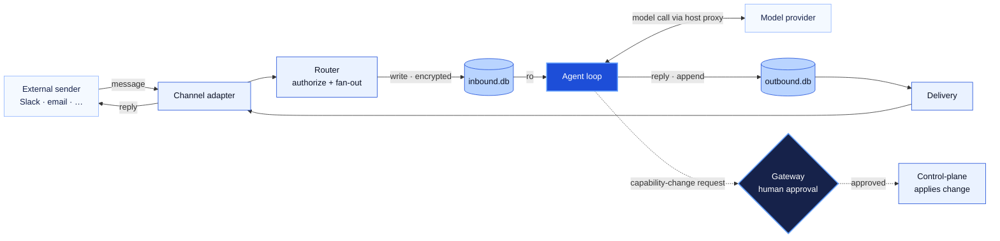
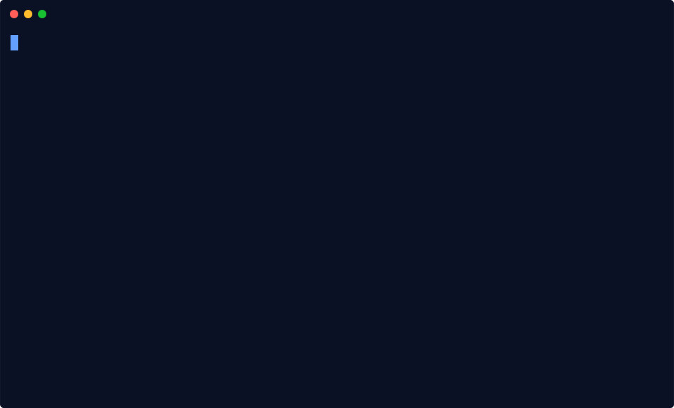
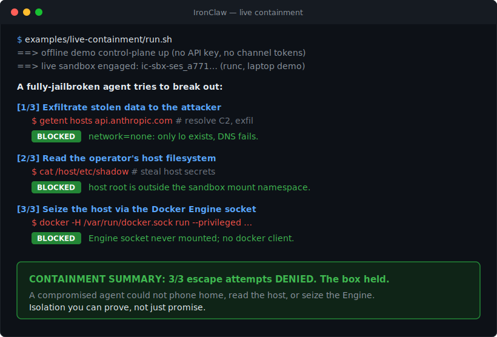

<div align="center">



### Self-hosted AI agents you do not have to trust.

Each one runs sealed in a sandbox that provably cannot phone home, read your host, or rewrite its own rules.

<!-- One curated row, stars first. The supply-chain trust badges (Scorecard, cosign, SBOM, SLSA) live beside the release-verification story below, where they carry more weight. -->
[](https://github.com/IronSecCo/ironclaw/stargazers)
[](https://www.bestpractices.dev/projects/13348)
[](https://github.com/IronSecCo/ironclaw/actions/workflows/codeql.yml)
[](https://github.com/IronSecCo/ironclaw/releases/latest)
[](LICENSING.md)
[](https://ironsecco.github.io/ironclaw/)

**If a safer way to run agents is worth having, [star the repo](https://github.com/IronSecCo/ironclaw)** to follow along and help others find it. Then try the zero-credential [quickstart](docs/quickstart.md).

</div>

**IronClaw runs autonomous AI agents on infrastructure you control**, reached through the chat apps
you already use. Each agent can read, write, schedule, and reply like any assistant, but it lives
inside a sealed sandbox with `network=none`: it reaches the model only through a host proxy, and it
**cannot change its own configuration.** It is for anyone who wants what agents can do without
handing an autonomous program the keys to their machine.

<div align="center">


<sub><b>Watch it catch a real escape.</b> A fully-jailbroken agent inside a real sandbox tries to phone home, read the host filesystem, and seize the host through the Docker socket. Each attempt is <b>denied</b> at the isolation boundary, then a containment summary prints. One command, zero credentials, reduced-motion friendly. <a href="examples/live-containment/"><code>examples/live-containment/run.sh</code></a></sub>

</div>

**⭐ Like the idea of agents you do not have to trust? [Star the repo](https://github.com/IronSecCo/ironclaw)** so
it is one click to follow along and easier for the next person to find. Then run the exact demo above
in 30 seconds, no signup and no API key.

### Try it in 30 seconds (zero credentials)

Make sure the **Docker daemon is running** (start Docker Desktop, or `sudo systemctl start docker`
on Linux), then paste one block:

```sh
git clone https://github.com/IronSecCo/ironclaw.git && cd ironclaw
examples/live-containment/run.sh   # builds the sandbox once, engages a real sandbox, proves it holds
```

That single command runs the whole secured path on your laptop: it starts the offline mock-agent
control-plane (**no API key**), engages a **real per-session sandbox**, lets a jailbroken agent try
to break out, and prints the containment summary you saw above. Want to chat with an agent in a
browser first? Run [`hello-ironclaw`](examples/hello-ironclaw/) or the
[zero-credential quickstart](docs/quickstart.md). Production seals each sandbox with gVisor and
`network=none`.

> [!WARNING]
> **Alpha software, work in progress. Please read before relying on it.**
>
> - **It's an alpha.** Flags, the on-disk format, and the HTTP/contract surfaces can still change without notice or a migration path. Don't point it at anything you can't afford to lose.
> - **Not every feature is tested end-to-end.** The control-plane, gateway, and encrypted-queue core have real coverage (800+ Go tests plus a black-box parity suite); channel adapters, some tools, multi-provider routing, and a live sandbox launch are exercised more lightly. Treat anything outside the [tested core](#project-status) as experimental.
>
> macOS gets a weaker sandbox boundary than Linux+gVisor, and **native Windows can't run the agent sandbox at all** (use WSL2). See [Platform support](#platform-support).

> **The security model, in one line:** each sandboxed agent runs with `network=none`, reaches the
> model only through a host proxy, and **cannot change its own configuration.** Every capability
> change is held at a gateway for a human decision. The full design is in the
> [architecture overview](docs/architecture.md) and the [threat model](docs/threat-model.md).

### See the whole journey, end to end

<div align="center">



<sub><b>Zero credentials, one command.</b> The offline <code>mock-agent</code> runs the full chat to per-session sandbox to reply path with no API key. Production seals each sandbox with gVisor and <code>network=none</code>. <a href="docs/quickstart.md">Quickstart</a></sub>

<br><br>


<sub><b>Zero-cred demo, connect a real provider, first approved task.</b> The one credential step keeps the key host-side; every agent change is held at the gateway for a human, then written to the append-only audit log. Animation freezes on the final frame under <code>prefers-reduced-motion</code>. <a href="docs/quickstart.md">Quickstart</a></sub>

</div>

## Get running in under two minutes

One command installs the two host binaries (`ironctl` + `ironclaw-controlplane`); in dev mode the
control-plane serves its API at **`http://127.0.0.1:8787`**. From a cold machine, you'll have a
capability change waiting at the security gateway in **under two minutes**:

```sh
# 1. Install — detects your OS/arch and verifies the SHA-256 checksum before installing
curl -fsSL https://raw.githubusercontent.com/IronSecCo/ironclaw/main/scripts/install.sh | sh

# 2. Start the control-plane in dev mode — API base URL: http://127.0.0.1:8787
export IRONCLAW_API_TOKEN=$(openssl rand -hex 32)
ironclaw-controlplane --dev --api-addr 127.0.0.1:8787 &

# 3. Your first command — submit a change; it is HELD at the gateway for a human decision
ironctl change submit --kind persona --group dev-agent --by you
ironctl change pending                       # see it waiting
ironctl change approve <change-id> --by you   # apply it
```

On Windows, `irm https://raw.githubusercontent.com/IronSecCo/ironclaw/main/scripts/install.ps1 | iex`
installs the host binaries (`ironclaw-controlplane.exe` + `ironctl.exe`) and `--dev` runs, but the
**agent sandbox needs WSL2 or Linux** — see [Windows via WSL2](#windows-via-wsl2).
Version pinning, system-wide installs, and building from source are all in [Installation](#installation).

### One-click cloud deploy

Run the **hardened control-plane** on a PaaS in ~2 minutes with zero local tooling — the
approval gateway, encrypted per-session queues, host-side credential custody, and the web
console:

[](deploy/fly/)
[](https://render.com/deploy?repo=https://github.com/IronSecCo/ironclaw)
[](deploy/railway/)

> These PaaS paths run the **control-plane only** — a single container has no gVisor and
> no Docker socket, so **agent sandboxes don't launch there** (same boundary as the
> [hardened Compose path](deploy/docker-compose.prod.yml)). For full agent isolation use
> a gVisor host or k8s node. Details + env in the
> [deployment guide](docs/deployment.md) (**Path D**).

## CLI-first and API-first

This is a feature, not a missing dashboard. Every capability is a documented HTTP endpoint **and** an
`ironctl` subcommand, so IronClaw is scriptable, auditable, and CI-friendly from the first command —
with **no public web surface to phish, misconfigure, or leave exposed.** (There is now a private,
mesh-only web console at `/ui/` — but it's **additive, never the only way in**, and rides the same
Tailscale-bound API, so it adds no public port.)

---

<details>
<summary><b>Table of contents</b></summary>

- [Get running in under two minutes](#get-running-in-under-two-minutes)
- [CLI-first and API-first](#cli-first-and-api-first)
- [Why it's different](#why-its-different)
- [How it works](#how-it-works)
- [Platform support](#platform-support)
- [Project status](#project-status)
- [Prerequisites](#prerequisites)
- [Installation](#installation)
- [Quickstart](#quickstart)
- [Examples](#examples)
- [Usage](#usage)
- [Model providers](#model-providers)
- [Configuration](#configuration)
- [Development](#development)
- [Repository layout](#repository-layout)
- [Security](#security)
- [Roadmap](#roadmap)
- [Community](#community)
- [Contributing](#contributing)
- [License](#license)

</details>

## Why it's different

| Pillar | What it is | Attack surface it removes |
|--------|------------|----------------------------|
| **Sealed runtime** | The agent ships as a compiled Go binary | Agent self-modification — there's no source inside the box to rewrite |
| **Approved by humans** | Every change to the harness clears a deterministic gateway | Silent setting changes — nothing changes without a human seeing and approving it |
| **Encrypted queues** | Per-session encrypted message queues; read-only inbound | Data theft at rest, and cross-session reads |
| **Sealed sandbox** | gVisor container, no network, host-proxied model calls | Data exfiltration and sandbox escape |
| **Private control panel** | Admin access over a private mesh (Tailscale) only | Remote attacks on the controls |

The throughline: **treat the agent as untrusted, and make the security boundary something you can
verify — not something you take on faith.**

> ⚖️ **Weighing your options?** See [**Why IronClaw / vs. the alternatives**](https://ironsecco.github.io/ironclaw/comparison/)
> for an honest comparison against hosted agent platforms, raw container + LLM glue, and other
> self-hosted agent runtimes.

## How it works

Two compiled Go programs that never share memory and talk only through a pair of encrypted SQLite
files per conversation:



- The **control-plane** receives chats, routes them, holds the keys, runs the approval gateway, and
  performs every privileged action on the agent's behalf — after its own checks.
- The **sandbox** — one per conversation, wrapped in gVisor with no network of its own — reads its
  encrypted inbox (read-only), calls the AI model through the host proxy, and writes its encrypted
  outbox. It can *request* a capability change but can never apply one.
- The **frozen contract** (`internal/contract`) is the only package both sides import: typed IDs,
  row shapes, the embedded SQL schema, pinned cipher params, and the gateway protocol.

A single message rides a clean loop; anything that would change what the agent *can do* takes the
separate dashed path through the human-approval **gateway**:



For the full design, see [`docs/architecture.md`](docs/architecture.md),
[`docs/threat-model.md`](docs/threat-model.md), and the plain-language tour in
[`docs/ironclaw-explained.md`](docs/ironclaw-explained.md).

> 📚 **Full documentation site:** [**ironsecco.github.io/ironclaw**](https://ironsecco.github.io/ironclaw/)
> — quickstart, architecture, threat model, channels, skills, the OpenAPI reference, and security,
> all in one navigable place (built from `docs/` and published on every push to `main`).
>
> 🧭 **New here?** The [**hands-on tutorials**](https://ironsecco.github.io/ironclaw/tutorials/) take
> you from `git clone` to a running agent: [your first sandboxed agent in 5 minutes](https://ironsecco.github.io/ironclaw/tutorials/first-agent/),
> [connecting Slack](https://ironsecco.github.io/ironclaw/tutorials/connect-slack/), and
> [writing a custom channel adapter](https://ironsecco.github.io/ironclaw/tutorials/custom-channel-adapter/).

## Platform support

IronClaw's security model rests on **gVisor** (`runsc`) — a user-space kernel that intercepts the
agent's Linux syscalls and is the layer that actually *enforces* `network=none`, the seccomp
syscall allowlist, dropped Linux capabilities, and a read-only rootfs. **gVisor is Linux-only**, and
that one fact drives the whole platform story:

| Capability | Linux + gVisor (production target) | macOS / Windows |
|---|---|---|
| Host side — control-plane, gateway, API, `ironctl`, web console | ✅ native | ✅ native (incl. native Windows) |
| Real agent sandbox | ✅ gVisor (`runsc`) | ⚠️ `--runtime docker` only — runc in Docker Desktop's Linux VM. **macOS:** Docker Desktop. **Windows:** WSL2 (native Windows can't reach it — see below) |
| Per-sandbox syscall interception | ✅ | ❌ not available |
| Seccomp syscall allowlist | ✅ enforced | ❌ not applied on the Docker path |
| `network=none` | ✅ enforced by the OCI spec | ⚠️ **not auto-enforced** — you must point `IRONCLAW_DOCKER_NETWORK` at a no-egress network |
| Dropped capabilities · read-only rootfs | ✅ enforced by the runtime | ⚠️ only as strong as the Docker Desktop VM kernel |

**On macOS** you can build, script, demo, and develop against the entire system natively, and you
can even run agents through Docker Desktop — but understand that the sandbox boundary then comes from
**runc inside the Docker Desktop Linux VM, not gVisor.** There is no per-sandbox syscall
interception, the curated seccomp profile is not applied, and `network=none` is not enforced for you
(the Docker isolator passes whatever network you configure straight through — set
`IRONCLAW_DOCKER_NETWORK` to a no-egress bridge yourself). That is **weaker than the posture the
[threat model](docs/threat-model.md) assumes.**

### Windows via WSL2

The `install.ps1` PowerShell installer gives you the **host plane** natively on Windows:
`ironclaw-controlplane.exe` and `ironctl.exe` run, the encrypted SQLCipher queue works, and `--dev`
mode (no real sandbox) runs end-to-end. **A real agent sandbox does not run on native Windows** —
gVisor (`runsc`) is Linux-only, and the Docker fallback talks to the Docker Engine over a **Unix**
socket (`/var/run/docker.sock`), which native Windows Docker Desktop does not expose (it serves a
Windows named pipe instead). So on native Windows you get the control plane and `ironctl`, but the
agent runtime has nowhere to launch.

**To actually run agents on Windows, use WSL2:**

```powershell
wsl --install -d Ubuntu          # one-time: install WSL2 + Ubuntu, then reboot
```

Then, **inside the WSL2 Ubuntu shell**, install the Linux build and run it exactly as on Linux:

```sh
curl -fsSL https://raw.githubusercontent.com/IronSecCo/ironclaw/main/scripts/install.sh | sh
```

Inside WSL2, `/var/run/docker.sock` is present (Docker Desktop's WSL integration, or Docker installed
in the distro), so `IRONCLAW_RUNTIME=docker` launches real Linux sandbox containers. For the full
gVisor posture, install `runsc` inside the WSL2 distro just as you would on bare-metal Linux. Treat a
WSL2 host the same as the Linux row above.

**For anything past local development, run the sandbox host on Linux with gVisor** (bare-metal,
a VM, or WSL2). The control plane can live wherever you like — including native Windows — but it's
the agent sandbox that needs the Linux + gVisor substrate to give you the boundary IronClaw is built
around.

## Project status

[](#project-status)
[](https://pkg.go.dev/github.com/IronSecCo/ironclaw)

**Alpha.** The architecture is settled and the full control-plane and sandbox pipelines are
implemented and tested. The encrypted-queue binding is now wired:

- **Encrypted-SQLite queue binding** — ✅ wired (**RFC-0001 applied**). `contract.Open*` open
  per-session SQLCipher databases via cgo (`github.com/mutecomm/go-sqlcipher/v4`); a round-trip test
  covers write→read, read-only-write rejection, wrong-key failure, and no-plaintext-on-disk. The
  build now requires `CGO_ENABLED=1` (a C toolchain). `internal/host/queue` uses the live binding;
  in-memory backends remain for `--dev` and tests.
- **Sandbox rootfs provisioning** — ✅ wired via a pluggable provisioner: `isolation` builds the
  hardened OCI spec, provisions the bundle rootfs (with image digest/signature verification against a
  trust policy), and execs `runsc`. A real launch still needs `runsc` and a provisioned/signed image
  present in the environment.
- **Production hardening (Wave 4)** — durable/pluggable master-key custody, a Prometheus `/metrics`
  surface, structured logging, host respawn + sandbox provider backoff, and model-proxy rate
  caps/audit/redaction have landed **and are composed into `cmd/controlplane`**. The API-server
  hardening knobs (optional TLS, rate-limit, body limits, `/readyz` readiness gate) exist as
  `api.With*` options but aren't attached in the entrypoint yet (see the [roadmap](#roadmap)).

See the [roadmap](#roadmap) for what remains. You can build, test, and run the control-plane today;
a live sandbox launch needs `runsc` plus a provisioned image.

## Prerequisites

| Requirement | For | Notes |
|-------------|-----|-------|
| **Go 1.23+ and a C toolchain** | building everything | `CGO_ENABLED=1` is required — the encrypted-SQLite binding builds via cgo |
| **containerd + gVisor (`runsc`)** | production sandboxing | runtime `io.containerd.runsc.v1`; not needed for `--dev` |
| **Tailscale** | remote admin access | the control-plane API binds to the tailnet IP; no public port |
| **SQLCipher (vendored)** | encrypted queues | the SQLCipher C amalgamation is vendored by the driver; no system lib needed |
| **A model credential** | live model calls | an Anthropic / OpenAI / OpenRouter key, or a gateway like OneCLI — injected host-side into the model proxy, never into the sandbox ([Model providers](#model-providers)) |

The three external runtime dependencies (gVisor, Tailscale, the encrypted-SQLite binding) are
intentionally **not vendored**. See [`deploy/README.md`](deploy/README.md) for host setup.

## Installation

### Homebrew (macOS / Linux)

```sh
brew tap IronSecCo/ironclaw https://github.com/IronSecCo/ironclaw
brew install ironsecco/ironclaw/ironclaw
```

This installs `ironctl`, `ironclaw-controlplane`, and `ironclaw-sandbox` from the latest release. The
formula pins each archive to the SHA-256 recorded in the release's signed `SHA256SUMS`, so Homebrew
verifies the download before installing. Confirm it with `ironctl version`.

Homebrew always installs the **latest** release. To pin an older version, use the installer
script's `IRONCLAW_VERSION` ([below](#prebuilt-binaries-installer-script)) or grab the archive
by hand — the tap carries only the current release.

> **Use the fully-qualified name.** homebrew-core ships an *unrelated* formula also called `ironclaw`,
> and core wins the bare name — so install `ironsecco/ironclaw/ironclaw`, not bare `ironclaw`. The
> explicit tap URL is required too: our tap lives in this repo, not a `homebrew-ironclaw` repo.

> In production the control plane usually runs as the GHCR container image (see the
> [deployment guide](https://ironsecco.github.io/ironclaw/deployment/)); the native
> `ironclaw-controlplane` binary is convenient for local / `--dev` runs.

### Prebuilt binaries (installer script)

One command installs the latest release — `ironctl` and `ironclaw-controlplane`. The script
detects your OS/arch, downloads the matching archive from
[GitHub Releases](https://github.com/IronSecCo/ironclaw/releases), and verifies its SHA-256
checksum before installing.

**macOS / Linux**

```sh
curl -fsSL https://raw.githubusercontent.com/IronSecCo/ironclaw/main/scripts/install.sh | sh
```

**Windows (PowerShell)**

```powershell
irm https://raw.githubusercontent.com/IronSecCo/ironclaw/main/scripts/install.ps1 | iex
```

> This installs the **host binaries** (`ironclaw-controlplane.exe` + `ironctl.exe`) and runs `--dev`
> natively, but it **cannot run a real agent sandbox** — that needs Linux. To run agents on Windows,
> install inside **WSL2**; see [Windows via WSL2](#windows-via-wsl2).

A fresh release is published on every push to `main`, with prebuilt archives for:

| OS | Architectures |
|----|---------------|
| macOS | Intel (`amd64`) · Apple Silicon (`arm64`) |
| Linux | `amd64` · `arm64` |
| Windows | `amd64` |

The installer reads a few environment variables (pass them on the `sh` side of the pipe):

```sh
# Pin a version instead of latest
curl -fsSL https://raw.githubusercontent.com/IronSecCo/ironclaw/main/scripts/install.sh | IRONCLAW_VERSION=v0.1.102 sh

# Install system-wide (a normal user defaults to ~/.local/bin)
curl -fsSL https://raw.githubusercontent.com/IronSecCo/ironclaw/main/scripts/install.sh | sudo sh

# Choose the install directory
curl -fsSL https://raw.githubusercontent.com/IronSecCo/ironclaw/main/scripts/install.sh | IRONCLAW_BINDIR="$HOME/bin" sh
```

Then confirm what you installed:

```sh
ironctl --version
```

Prefer to grab files by hand? Download the archive and `SHA256SUMS` for your platform from the
[latest release](https://github.com/IronSecCo/ironclaw/releases/latest).

### Verifying a release

Releases are **signed and attested** — a keyless [cosign](https://docs.sigstore.dev/)
signature over `SHA256SUMS`, an **SBOM** (SPDX + CycloneDX), and build-provenance attestations for
every archive and the container image. For how releases are cut, verified, and yanked, see the
[release runbook](docs/release-runbook.md).

[](https://scorecard.dev/viewer/?uri=github.com/IronSecCo/ironclaw)
[](#verifying-a-release)
[](#verifying-a-release)
[](#verifying-a-release)

<details>
<summary>Verifying a signed release</summary>

Each release carries `SHA256SUMS` plus `SHA256SUMS.sig` + `SHA256SUMS.pem` (the cosign signature and
its certificate), `*.spdx.json` / `*.cdx.json` SBOMs, and per-archive + image attestations.

Verify the checksum signature (no key to manage — the identity is the release workflow):

```sh
cosign verify-blob SHA256SUMS \
  --signature SHA256SUMS.sig --certificate SHA256SUMS.pem \
  --certificate-identity-regexp '^https://github.com/IronSecCo/ironclaw/' \
  --certificate-oidc-issuer https://token.actions.githubusercontent.com
sha256sum -c SHA256SUMS        # then confirm your archive matches
```

Verify build provenance for an archive, an extracted binary, or the image:

```sh
gh attestation verify ironclaw_<version>_<platform>.tar.gz --repo IronSecCo/ironclaw
gh attestation verify ./ironctl --repo IronSecCo/ironclaw   # a binary extracted from the archive
gh attestation verify oci://ghcr.io/ironsecco/ironclaw-controlplane:latest --repo IronSecCo/ironclaw
```

The container image also carries a signed **SBOM attestation** (CycloneDX) you can verify
and read anonymously:

```sh
gh attestation verify oci://ghcr.io/ironsecco/ironclaw-controlplane:latest \
  --repo IronSecCo/ironclaw \
  --predicate-type https://cyclonedx.org/bom
```

Every third-party GitHub Action is **pinned to a commit SHA**, builds use a **pinned
toolchain + `-trimpath`** and are checked for **bit-for-bit reproducibility** by a
double-build CI job (`ironctl` and `sandbox` are verified byte-identical; the larger
control-plane binary is reproducible under newer Go and tracked for the pinned toolchain),
and the project's supply-chain posture is scored continuously by
[OpenSSF Scorecard](https://scorecard.dev/viewer/?uri=github.com/IronSecCo/ironclaw) (see the badge above).

</details>

### From source

Requires Go 1.23+ and a C toolchain (`CGO_ENABLED=1` — the encrypted-SQLite binding builds via cgo).

```sh
# Clone
git clone https://github.com/IronSecCo/ironclaw.git
cd ironclaw

# Build all binaries
make build            # == go build ./...

# Or install the two host binaries onto your PATH
go build -o /usr/local/bin/ironclaw-controlplane ./cmd/controlplane
go build -o /usr/local/bin/ironctl               ./cmd/ironctl
```

For a full system install — build and install the binaries, provision `/etc/ironclaw`
and `/var/lib/ironclaw`, and enable the service (systemd on Linux, launchd on macOS) —
run [`sudo deploy/install.sh`](deploy/install.sh). It needs root to write under `/etc`
and `/var/lib`. The external runtime dependencies it relies on (containerd + gVisor and
Tailscale) are set up separately — see [`deploy/README.md`](deploy/README.md).

### With Docker (`docker compose`)

Self-host the control-plane in one command. From a clone:

```sh
cp .env.example .env          # fill in ANTHROPIC_API_KEY (optional to boot)
docker compose up -d          # builds locally on first run, or pulls the GHCR image
docker compose logs -f controlplane   # CLAIM the admin token printed once on first run
```

The admin/API token is **minted on first run and printed once** in the logs (there is
no recovery) unless you set `IRONCLAW_API_TOKEN` yourself. The admin API is published
on `127.0.0.1:8787` only — front it with Tailscale for remote access.

Prefer the published image? It is pushed to GitHub Container Registry on every release:

```sh
docker pull ghcr.io/ironsecco/ironclaw-controlplane:latest
# or pin a release: docker pull ghcr.io/ironsecco/ironclaw-controlplane:v0.1.102
```

Set `IRONCLAW_IMAGE` in `.env` to pin that tag for `docker compose`. Every variable the
control-plane reads is documented in [`.env.example`](.env.example). The agent sandboxes
themselves are **not** compose services — the control-plane launches them as gVisor
(`runsc`) children with `network=none`; running real sandboxes needs a runsc-capable
host (see [`deploy/README.md`](deploy/README.md)).

Going to production? The **[deployment guide](https://ironsecco.github.io/ironclaw/deployment/)**
covers the hardened, durable posture: locked-down [`deploy/docker-compose.prod.yml`](deploy/docker-compose.prod.yml)
(read-only rootfs, dropped caps, resource limits) behind a TLS reverse proxy
([`deploy/Caddyfile`](deploy/Caddyfile)), secrets via an env-file, encrypted-state
backup/restore, pinned-digest upgrades, and Prometheus `/metrics`.

## Quickstart

A fuller local walkthrough — run the control-plane **from source** in dev mode (no gVisor, binds to
loopback) and drive it with the admin CLI:

```sh
# Terminal 1 — start the control-plane in dev mode
export ANTHROPIC_API_KEY=sk-ant-...        # held host-side; never enters the sandbox
export IRONCLAW_API_TOKEN=$(openssl rand -hex 32)
go run ./cmd/controlplane --dev --api-addr 127.0.0.1:8787

# Terminal 2 — talk to the gateway with ironctl
export IRONCLAW_API_TOKEN=<same token as above>

# Submit a capability change — it is HELD pending a human decision (the gateway choke point)
ironctl change submit --kind persona --group dev-agent --by alice

# See what's waiting for approval, then approve or reject by id
ironctl change pending
ironctl change approve <change-id> --by alice

# Inspect the append-only audit log
ironctl audit --limit 20
```

Every mutation — persona, enabled tools, packages, wiring, permissions, mounts — flows through this
same gateway. There is no file-edit path that bypasses it.

## Examples

Two of them run **end to end with zero credentials** — no model key, no channel tokens,
just Docker. Copy one line and watch it work:

<div align="center">



<sub><b><a href="examples/hello-ironclaw/">hello-ironclaw</a> — the canonical "it works."</b> One command sends a chat through the <b>real</b> secured path (engage → per-session sandbox → encrypted queue → reply) and asserts the reply returns. Zero credentials; doubles as the CI smoke test. Animation freezes on the final frame under <code>prefers-reduced-motion</code>.</sub>

<br><br>



<sub><b><a href="examples/live-containment/">live-containment</a> — watch it catch a real escape.</b> The 60-second security aha: one command engages a real sandbox, a fully-jailbroken agent <b>tries to break out</b> (network exfil, host-filesystem breakout, host takeover via the Docker socket), and your terminal shows each attempt <b>denied</b> plus a containment summary. The curated cut of <code>red-team-escape</code>. Zero credentials.</sub>

<br><br>


<sub><b><a href="examples/red-team-escape/">red-team-escape</a> — isolation you can prove.</b> The full six-assertion battery behind <code>live-containment</code>: adds sibling-breakout and cross-session key-custody probes and emits a <b>signed, versioned containment report</b>; runs as the CI containment gate on every push. Zero credentials.</sub>

</div>

Runnable recipes live in [`examples/`](examples/) — each is a directory with a `README.md` and a `setup.sh`.
Three of them ship a `run-mock.sh` that drives the **whole** inbound → agent → reply pipeline on the
offline `mock` provider, so a fresh clone runs them with **no model key and no channel tokens**:

```sh
docker compose -f docker-compose.demo.yml up -d --build   # seeds the offline mock-agent
./examples/scheduled-report/run-mock.sh                   # cron-style self-scheduling summary
./examples/webhook-responder/run-mock.sh                  # inbound webhook → agent reply
./examples/slack-triage/run-mock.sh                       # classify/label every message
```

- [`scheduled-report/`](examples/scheduled-report/) — wakes itself on a schedule (`schedule_task`), summarizes, posts to a channel. *(credential-free demo)*
- [`webhook-responder/`](examples/webhook-responder/) — routes an inbound HTTP webhook to an agent that replies. *(credential-free demo)*
- [`slack-triage/`](examples/slack-triage/) — classifies/labels every incoming Slack message. *(credential-free demo)*
- [`personal-assistant/`](examples/personal-assistant/) — a private 1:1 assistant on Telegram, plus a walk-through of the mandatory change-approval flow.
- [`channel-triage/`](examples/channel-triage/) — a Slack triage bot that engages only on `@mention`, only for known senders.
- [`multi-agent-team/`](examples/multi-agent-team/) — two agents sharing one channel, separated by engage mode and priority.

## Usage

### `ironclaw-controlplane` — the host daemon

```sh
ironclaw-controlplane \
  --api-addr "$(tailscale ip -4):8787" \            # bind to the tailnet IP (no public port)
  --model-proxy-socket /run/ironclaw/modelproxy.sock \
  --runtime runsc \                                 # container runtime for sandboxes
  --state-dir /var/lib/ironclaw \
  --sweep-interval 60s
```

| Flag | Default | Purpose |
|------|---------|---------|
| `--api-addr` | `127.0.0.1:8787` | control-plane API address; set to the tailnet IP in production |
| `--model-proxy-socket` | `/run/ironclaw/modelproxy.sock` | unix socket bound into each sandbox for model egress |
| `--state-dir` | OS-specific | gateway change store, audit log, keystore |
| `--runtime` | `runsc` | OCI runtime for sandboxes |
| `--bundle-root` | `<state-dir>/bundles` | per-session OCI bundles |
| `--sweep-interval` | `60s` | stale-sandbox / due-message sweep cadence |
| `--egress-socket` | `""` (sealed) | opt-in: host unix socket for the egress broker, bound into each sandbox so an agent can reach **approved** external hosts (deny-by-default, audited) |
| `--egress-allow` | `""` | comma-separated hostnames the egress broker permits (only with `--egress-socket`) |
| `--search-backend` | `""` (off) | give each sandbox the `web_search` tool: `duckduckgo` (keyless) or `brave[:cred]` (keyed via the vault). Requires `--egress-socket`; the backend's host is auto-added to the allowlist |
| `--mcp-catalog` | `""` (off) | opt-in: enable MCP servers — a per-session host broker, the `mcp_access` change kind, and the **MCP** console tab. The 0600 JSON catalog of configured servers |
| `--mcp-isolation` | `container` | how **local** (stdio) MCP servers run: `container` (hardened, `network=none` — production) or `none` (bare host process — dev only) |
| `--mcp-runtime` / `--mcp-image` | `""` | OCI runtime (e.g. `runsc` for gVisor) and default image for isolated local MCP servers |
| `--dev` | `false` | loopback bind, no gVisor — local development only; also opens a **DuckDuckGo-only** egress path so `web_search` works out of the box, and enables MCP with `--mcp-isolation=none` |

#### MCP servers

Extend an agent with the tools of a **Model Context Protocol** server — local (a stdio
subprocess) or remote (an HTTPS endpoint) — without weakening the sandbox. MCP runs
**host-side only**: a local server is isolated in a hardened `network=none` container, a
remote one is dialed over TLS, and the sandbox reaches neither directly — it talks to a
**per-session broker socket** where every call is checked against a **per-tool,
human-approved grant** and audited. This closes the "blind MCP approval" gap the
reference design had. Enable it with `--mcp-catalog`, add servers + grant agents on the
console's **MCP** tab, and try it end to end with the bundled `cmd/mcp-sample` server.
Full guide: [docs/mcp.md](docs/mcp.md).

Environment: `ANTHROPIC_API_KEY` (model proxy credential, host-only) and `IRONCLAW_API_TOKEN`
(bearer token required on every API call when set).

#### Web search

The sandbox is `network=none`; it can only reach hosts through the host-mediated, audited
egress broker. The `web_search` tool rides that broker, so it is **off by default** and turns
on only with both `--egress-socket` and `--search-backend`:

- `duckduckgo` — keyless, no secret. The quickest way to a working search, but DuckDuckGo's
  keyless API returns instant answers / related topics rather than a full ranked web index, so
  specific lookups (e.g. a person's name) can come back thin.
- `brave[:cred]` — Brave Search reached **by name** through the credential vault
  (`vault://<cred>/…`), so the API key stays host-side in the injector and never enters the
  sandbox. Requires `--vault-endpoint` with a matching credential.

`--dev` enables the DuckDuckGo backend automatically (placing the egress socket next to the
model-proxy socket so it rides the same sandbox mount). Under the Docker isolator, make sure the
directory holding those sockets is in `IRONCLAW_DOCKER_BINDS` so the sandbox can reach it.

### `ironctl` — the admin CLI

A thin client of the control-plane API. `--addr` defaults to `http://127.0.0.1:8787`; the bearer
token comes from `IRONCLAW_API_TOKEN` or `--token`.

```sh
ironctl change submit  --kind <k> --group <g> --by <user>   # k: persona|enabled_tools|packages|wiring|permissions|mounts
ironctl change pending                                       # list changes awaiting a decision
ironctl change history                                       # all changes and their outcomes
ironctl change approve <id> --by <user>
ironctl change reject  <id> --by <user>
ironctl audit [--limit N]                                    # append-only gateway audit log
```

#### Define an agent the easy way

You don't have to know tool names or hand-write JSON. Pick a starter template, tweak it, and go —
in one step, from the CLI or the web console's **Agents → Create** builder:

```sh
ironctl tools                                  # browse every built-in tool, grouped, with descriptions
ironctl agent templates                        # list starter presets (assistant, researcher, …)

# Guided wizard (run in a terminal with no flags): name → template → persona → tools → confirm
ironctl agent create

# Or one-shot/scriptable — template + a couple extra tools, persona override, default model:
ironctl agent create --name "Research Bot" --template researcher --tool schedule_task
ironctl agent create --name "Helper" --template assistant --all-tools --yes

ironctl agent list                             # all agents, with model + live session/channel counts
ironctl agent show research-bot                # persona, model, enabled tools, installed skills
```

**Persona as separate documents.** Rather than one opaque prompt, an agent's persona is split by
concern — **IDENTITY.md** (who it is), **SOUL.md** (personality/voice), and **AGENTS.md** (how it
works) — which compose into the system prompt. Set them inline, or point at a directory of those
files (the builder shows the same three fields):

```sh
ironctl agent create --name "Atlas" \
  --identity "You are Atlas, a research assistant for the data team." \
  --soul     "Curious and precise. You cite sources and admit uncertainty." \
  --instructions "Search before answering; prefer primary sources; summarize with links."

ironctl agent create --name "Atlas" --persona-dir ./atlas/   # loads IDENTITY.md / SOUL.md / AGENTS.md
```

This defines the agent (name + persona docs + model + tools) in a single operator-direct write.
Enabling a web/API tool only makes it *visible* to the agent — actual egress still requires an
approved host through the gateway, so the network posture is unchanged.

### `sandbox` — the in-sandbox agent

Launched by the control-plane's isolator, not by hand. It receives its session key and queue paths
and runs the reasoning loop. Key flags (`cmd/sandbox`): `--inbound`, `--outbound`, `--key`,
`--workspace`, `--heartbeat`, `--model-socket`, `--model-host`, `--model`.

### Control-plane HTTP API

| Method & path | Purpose |
|---------------|---------|
| `GET  /healthz` | liveness (unauthenticated) |
| `POST /v1/changes` | submit a `ChangeRequest` |
| `GET  /v1/changes/pending` | list pending changes |
| `GET  /v1/changes/history` | list all changes |
| `POST /v1/changes/{id}/decision` | record an approve/reject decision |
| `GET  /v1/audit` | read the audit log |

## Model providers

By default every agent talks to **Anthropic** (Claude). You can point an agent at **OpenAI** or
**OpenRouter** instead, or — without IronClaw holding any model key at all — route through an
operator-run **credential gateway** such as **OneCLI**, which injects the real credential at request
time. In every case the **sandbox stays `network=none` and credential-free**: it reaches the model
only through the host model-proxy unix socket, and the host proxy authenticates the call and enforces
the egress allowlist. The backend is chosen **per agent group, host-side** — a sandbox can never pick
or change its own provider.

### Direct provider keys

Set one or more keys host-side (daemon env, or `.env` for `docker compose`). A provider's upstream
host is allowlisted only when its key is present:

```sh
export ANTHROPIC_API_KEY=sk-ant-...     # default / primary
export OPENAI_API_KEY=sk-...            # optional
export OPENROUTER_API_KEY=sk-or-...     # optional
```

### Via a credential gateway like OneCLI (ChatGPT/Codex — no key inside IronClaw)

A credential gateway is a host-local HTTP `CONNECT` proxy that holds the real credential and injects
it per request, so **neither the control-plane nor the sandbox ever sees a model key.** This is how
you power an agent with a **ChatGPT/Codex** account via **OneCLI**: IronClaw's `codex` provider
speaks the ChatGPT Codex Responses API (`chatgpt.com`) and OneCLI attaches the OAuth credential.

Run OneCLI on the host (its default address is `127.0.0.1:10255`), then point the model-proxy at it
and allowlist the host it serves:

```sh
# The gateway URL carries your per-agent OneCLI token as Basic userinfo — Go's HTTP
# client sends it as Proxy-Authorization on CONNECT. The gateway terminates TLS with
# its own CA, so upstream TLS verification is skipped (intended for a loopback gateway).
export IRONCLAW_MODEL_GATEWAY_URL="http://x:aoc_<your-onecli-agent-token>@127.0.0.1:10255"
export IRONCLAW_MODEL_GATEWAY_HOSTS="chatgpt.com"

# No ANTHROPIC_API_KEY needed — the gateway is the only credential path. Make the
# default backend Codex so every agent uses it out of the box:
export IRONCLAW_DEV_PROVIDER=codex
export IRONCLAW_DEV_MODEL=gpt-5.5

ironclaw-controlplane --api-addr 127.0.0.1:8787   # (+ your other flags)
```

When a gateway is set, don't also set a key for the host it serves — the gateway is the credential
path, and the control-plane injects nothing for the gateway's hosts. Under `docker compose` the
gateway must be reachable *from the container*, so use `host.docker.internal:10255` (Docker Desktop)
or put OneCLI and the control-plane on a shared Docker network instead of `127.0.0.1`.

### Run a 100% local model (Ollama, LM Studio, vLLM) — no cloud key

Point IronClaw at a self-hosted **OpenAI-compatible** endpoint and the whole stack runs on your own
box with **zero cloud credentials** — nothing leaves the machine. Ollama, LM Studio, vLLM, and
llama.cpp all expose the OpenAI `/v1` API (Ollama at `http://localhost:11434/v1`).

```sh
ollama pull llama3.2                                # 1. run a model locally
export IRONCLAW_LOCAL_MODEL_URL=http://localhost:11434/v1
export IRONCLAW_LOCAL_MODEL=llama3.2                # 2. point IronClaw at it
ironclaw-controlplane --dev --api-addr 127.0.0.1:8787   # 3. chat — no API key
```

This allowlists the local host, forwards to it over plain HTTP (these servers serve no TLS), and
makes it the deployment-default model, so every agent group without a pinned provider runs local. No
key is required; set `IRONCLAW_LOCAL_MODEL_KEY` only for the rare local server (e.g. a guarded vLLM)
that requires one. Under `docker compose` the server must be reachable *from the control-plane
container*, so use `http://host.docker.internal:11434/v1` (Docker Desktop) instead of `localhost`.
Full walkthrough: **[Run IronClaw with a 100% local model (Ollama)](docs/tutorials/local-model-ollama.md)**.

### Choosing the provider per agent

`IRONCLAW_DEV_PROVIDER` / `IRONCLAW_DEV_MODEL` set the deployment-wide default for any agent group
that doesn't pin one (the env names keep their `DEV_` prefix but apply deployment-wide). To choose
per agent instead — a gateway-approved change, like any other config:

```sh
ironctl agent create --name "Codex Bot" --provider codex  --model gpt-5.5
ironctl agent create --name "GPT Bot"   --provider openai --model gpt-4o
ironctl agent create --name "Local Bot" --provider local  --model llama3.2   # uses IRONCLAW_LOCAL_MODEL_URL
```

Valid `--provider` values: `anthropic` (default), `openai`, `openrouter`, `codex`, `gemini`,
`vertex`, `local` (a self-hosted OpenAI-compatible endpoint — Ollama/LM Studio/vLLM/llama.cpp), and
`mock` (a deterministic, offline backend for demos and tests). Each maps to a model-proxy-allowlisted
upstream; `codex` targets `chatgpt.com` and defaults to the `gpt-5.5` model, and `local` inherits the
loopback host from `IRONCLAW_LOCAL_MODEL_URL`.

## Configuration

- **State** lives under `--state-dir`: the durable gateway change store (survives restart), the
  append-only JSONL audit log, and the host keystore.
- **Secrets** are host-only. The model credential (an Anthropic / OpenAI / OpenRouter key, or a
  credential gateway like OneCLI — see [Model providers](#model-providers)) is applied to outbound
  model calls by the host `modelproxy`; the sandbox never sees it and has `network=none`. Per-session 256-bit keys are
  generated and held by the host and handed to the sandbox via tmpfs at launch — never via an env
  var, never baked into the image.
- **Mesh.** Bind `--api-addr` to the Tailscale interface and firewall the API port on every other
  interface. See [`deploy/README.md`](deploy/README.md).

## Development

```sh
make build     # go build ./...
make test      # go test ./...
make vet       # go vet ./...
make fmt       # gofmt -w .
```

All tests pass on a stdlib-only tree (the encrypted-SQLite CGo path is gated). The black-box
behavioral suite lives in [`test/parity/`](test/parity) and exercises routing fan-out, engage
modes, session resolution, delivery dedup, the gateway's mandatory-approval flow, and a cross-mount
live-poll spec — over the observable surfaces (the two queues + the API) only.

**The frozen contract.** `internal/contract/**` is the single seam both sides import and is
**frozen**: changing it requires a dated RFC in [`docs/contract.md`](docs/contract.md) and both
CODEOWNERS' approval. Drift here surfaces at runtime as a silent decrypt or routing failure, not a
build error — which is why the freeze is strict. See [`CONTRIBUTING.md`](CONTRIBUTING.md).

## Repository layout

```
ironclaw/
  cmd/
    controlplane/   # host daemon entrypoint
    sandbox/        # in-sandbox agent entrypoint
    ironctl/        # admin CLI
  internal/
    contract/       # FROZEN SEAM — shared types, schema, crypto, gateway protocol
    host/           # control-plane: api gateway isolation router delivery sweep keys channels modelproxy registry scheduling queue
    sandbox/        # sandbox: loop provider tools queue
  api/              # control-plane API reference
  deploy/           # host install script + notes (gVisor, containerd, Tailscale, systemd)
  docs/             # architecture, threat-model, contract (+ RFC log), building
  test/parity/      # black-box behavioral suite over the queues + API
```

## Security

IronClaw assumes the sandboxed agent is potentially compromised and designs the boundary so it
cannot escalate. The full threat-and-mitigation table is in
[`docs/threat-model.md`](docs/threat-model.md). Highlights:

- Compiled Go, no interpreter in the sandbox → the agent cannot read or edit its own source.
- All config mutations flow through the mandatory gateway → deterministic verifier chain → human
  approval → idempotent apply. There is no unapproved action path (the legacy `script`-field RCE
  class is designed out).
- Per-session encrypted queues; least-privilege access enforced three ways (Go interface
  segregation, `PRAGMA query_only`, read-only OS bind mount).
- `network=none` sandboxes; model calls only via the host proxy with a destination allowlist.

To report a vulnerability, please open a private security advisory rather than a public issue.

## Roadmap

> **The living roadmap is on the docs site:
> [Road to 1.0](https://ironsecco.github.io/ironclaw/roadmap/)** — the single source
> of truth. It tracks the *product* road to 1.0 (public launch, web UI, channels, and
> supply-chain trust) with a status-at-a-glance table and a comparison against the
> category. For the short, contributor-facing view — direction, what 1.0 means, and
> **help-wanted themes** — see [`ROADMAP.md`](ROADMAP.md). The checklist below is the
> **engineering build-log** for the security backend (Waves 0–5) and the hardening
> that followed.

- [x] Architecture and threat model
- [x] Compiling skeleton: frozen contract, control-plane and sandbox stubs, CI
- [x] Control plane (routing, gateway, isolation spec, key custody, delivery, sweep) on in-memory backends
- [x] Sandbox (agent loop, model provider, queue access, tools)
- [x] Encrypted-SQLite queue binding (RFC-0001) — live encrypted per-session queues
- [x] Cross-mount live-poll integration on the encrypted backend
- [x] Sandbox rootfs provisioning (pluggable) + durable per-group workspace/memory + image trust-policy verification
- [x] Concrete channel adapters: Telegram, Slack, Discord
- [x] Registry admin HTTP API + `ironctl` resource subcommands
- [x] Interactive `ask_user_question` + task-management tools (list/cancel/pause/resume/update)
- [x] End-to-end lifecycle integration test (fake isolator/provider over the real stack)

**Production hardening (Wave 4) — composed into the daemon:**

- [x] Durable / pluggable master-key custody (file-sealed keystore + KMS seam) — wired
- [x] Prometheus metrics (`/metrics`) and structured (`slog`) logging — wired
- [x] Host respawn crash-loop backoff + sandbox provider backoff/circuit breaker — wired
- [x] Model-proxy rate caps + audit logging + secret redaction — wired
- [x] Daemon wiring — the subsystems above are composed into `cmd/controlplane`
- [x] Production deployment units: systemd service + launchd plist, installer, container image, `docker compose`
- [ ] Attach the API-server hardening knobs (TLS, rate-limit, body limits, `/readyz` gate) in the entrypoint — the `api.With*` options exist but aren't wired yet
- [ ] Real `runsc` launch in a provisioned, signed-image environment

**Beyond the reference design — landed:**

- [x] Egress broker for approved external hosts — deny-by-default, audited, and the sandbox stays sealed `network=none` (host-brokered over a unix socket); powers the `web_search` tool
- [x] Kata Containers isolation backend behind the same hardened `Isolator` interface
- [x] Agent-to-agent (a2a) messaging + approval-gated `create_agent` (RFC-0004)
- [x] Multiple model providers — Anthropic, OpenAI, OpenRouter — selectable per agent group
- [x] MCP servers — host-brokered, with per-tool human-approved grants
- [x] Private, mesh-only web console at `/ui/`
- [x] Channel breadth beyond the first three — WhatsApp, Email/SMTP, Matrix, Google Chat, Microsoft Teams, Signal, iMessage, and Webhook, plus the in-product web chat playground (twelve delivery surfaces in all)

**Design-gated (built, off by default):**

- [x] Gateway auto-approval policy + RBAC — implemented as a verifier/approver, but **inert by default**: the mandatory-human floor is the only active path until an operator opts in

## Community

[](https://github.com/IronSecCo/ironclaw/discussions)
[](https://github.com/IronSecCo/ironclaw/issues?q=is%3Aissue+is%3Aopen+label%3A%22good+first+issue%22)

Questions, ideas, "is this a bug or am I holding it wrong?" — bring them to
**[GitHub Discussions](https://github.com/IronSecCo/ironclaw/discussions)**. It's the project's
home for Q&A, design discussion, and show-and-tell, and it's where maintainers answer first.

- **New to the project or want the full picture?** Read the
  [**documentation site**](https://ironsecco.github.io/ironclaw/) — architecture, threat model,
  quickstart, channels, and skills, all in one navigable place.
- **Found a bug or have a feature request?** Open an [issue](https://github.com/IronSecCo/ironclaw/issues/new/choose).
- **Security report?** Do **not** open a public issue — follow [`SECURITY.md`](SECURITY.md).
- **Want to contribute code?** Start with a
  [**good first issue**](https://github.com/IronSecCo/ironclaw/issues?q=is%3Aissue+is%3Aopen+label%3A%22good+first+issue%22)
  — these are small, self-contained, and mentored. See [Contributing](#contributing) for the workflow.
- **First time here?** Everyone interacting with the project is expected to follow our
  [**Code of Conduct**](CODE_OF_CONDUCT.md) — be excellent to each other.

We keep the whole community on GitHub — no Discord or Matrix to sign up for.
[**Discussions**](https://github.com/IronSecCo/ironclaw/discussions) is the live channel: subscribe
to a category to follow along, and watch the repo for **Announcements**.

## Contributing

See [`CONTRIBUTING.md`](CONTRIBUTING.md) for the contract-freeze rule, the code layout
(the control-plane and sandbox trees build against the frozen seam), how to report a vulnerability
([`SECURITY.md`](SECURITY.md)), our [Code of Conduct](CODE_OF_CONDUCT.md), and how to open a pull request.
New here? Pick up a [**good first issue**](https://github.com/IronSecCo/ironclaw/issues?q=is%3Aissue+is%3Aopen+label%3A%22good+first+issue%22).

## License

IronClaw is **dual-licensed** — see [`LICENSING.md`](LICENSING.md):

- **[GNU AGPLv3](LICENSE)** for open-source use. Running a modified IronClaw as a network
  service triggers the AGPL's copyleft — you must offer your users the corresponding source.
- **[Commercial license](LICENSING.md)** for closed-source / proprietary use without the AGPL
  obligations — contact a maintainer on LinkedIn ([Omer Zamir](https://www.linkedin.com/in/omerzamir) or [Topaz Aharon](https://www.linkedin.com/in/topaz-aharon/)).

© 2026 IronSecCo
