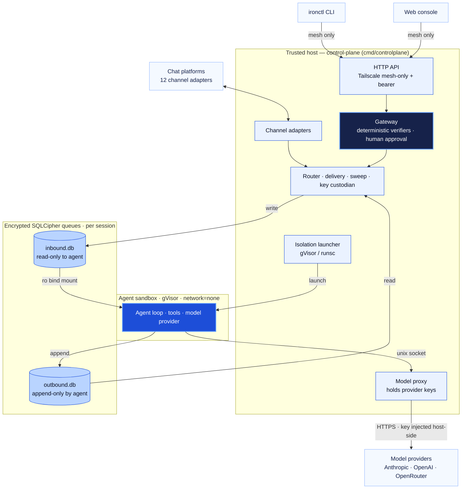
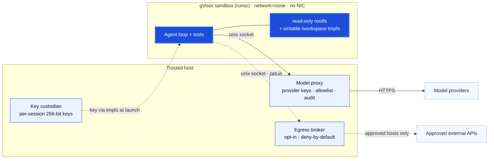
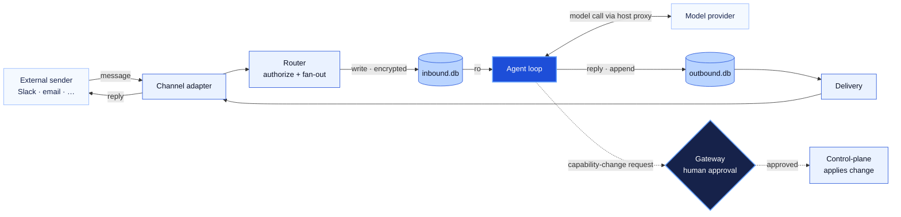

# Architecture

IronClaw is a security-hardened, open-source assistant platform written entirely
in Go. A host **control-plane** orchestrates per-session **sandboxes**; the two
sides communicate only through a pair of encrypted SQLite queues.

## System at a glance

How the pieces fit: operators and chat platforms reach the **control-plane**, which
owns every privileged action and holds every key; agents run in **gVisor sandboxes**
that can only read inbound and append outbound across a pair of **encrypted SQLCipher
queues**. The gateway (highlighted) is the one path that changes what an agent *is*.

## Sandbox isolation

The sandbox has **no network interface** (`network=none`). Its only crossings to the
outside are two host-owned unix sockets — the model proxy (always) and the egress
broker (opt-in, deny-by-default) — plus the bind-mounted queue files. The runtime
hardening (`runsc`) drops all capabilities, sets `no_new_privs`, runs non-root in a
user namespace, and mounts a read-only rootfs with only `/workspace` writable. The
per-session key arrives over a tmpfs at launch — never an env var or the image.

## Channel message flow

A message rides a clean loop — adapter → router → encrypted inbound queue → agent →
model → encrypted outbound queue → delivery → adapter. Anything that would change the
agent's capabilities takes the *separate* dashed path through the **gateway**, where a
human approves the exact change before the control-plane applies it.

## Components

- **Control-plane (host)** — HTTP API (mesh-only), the mandatory gateway,
  isolation launcher, router, delivery, sweep, key custodian, channel adapters,
  and the model-egress proxy.
- **Sandbox** — the reasoning poll loop, the model provider, in-sandbox
  tools, and the queue access layer.
- **Frozen contract** (`internal/contract`) — the only package both sides import:
  typed IDs, enums, row structs, embedded SQL schema, crypto open helpers,
  interface-segregated queue access, and the gateway protocol.

## Trust model (summary)

1. Compiled Go, no interpreter in the sandbox — the agent cannot read or edit its
   own source.
2. A mandatory gateway — every control-plane mutation is a deterministic,
   human-approved, auditable transaction. No file is the source of truth.
3. Encrypted per-session queues — disk theft and cross-session reads are useless.
4. Least-privilege queue access — the sandbox can only read inbound and write
   outbound, enforced at the Go type level and the OS mount level.
5. gVisor (runsc) wraps every sandbox, behind a pluggable Isolator.
6. Tailscale fronts the control-plane API; no public port.
7. The sandbox has `network=none`; model calls go through the host proxy.

## In-memory dev backends (control-plane)

The full control-plane pipeline — registry, router, queues, delivery, sweep, and
the gateway's durability — is interface-driven, with in-memory backends alongside
the durable ones so the pipeline and its tests run without provisioning encrypted
on-disk files:

- **`internal/host/registry`** — `Registry` interface + `MemRegistry`, the
  control-plane data model (agent groups, messaging groups, wirings, sessions,
  users, roles, members, destinations). Host-internal; the sandbox never sees it,
  so it is NOT part of the frozen contract. It owns session partitioning
  (shared / per-thread / agent-shared) and the access precedence
  (owner > global-admin > scoped-admin > member).
- **`internal/host/queue`** — `MemInbound` (implements both `contract.InboundWriter`
  and `InboundReader`) and `MemOutbound` (both `OutboundWriter` and
  `OutboundReader`) over a shared in-memory store, so a host writer and a test
  sandbox reader of the same session agree. Seq parity is enforced in the Write
  methods: host writes EVEN, sandbox writes ODD.
- **`internal/host/router`** — `RouteInbound(ctx, InboundEvent) ([]RoutingOutcome,
  error)` fans an event out to every wired agent group through an injected
  inbound-writer factory and `Waker`.
- **`internal/host/delivery`** — `Poll(ctx)` reads due outbound messages through an
  injected `OutboundReader` factory, dedups in memory (mirrored into the inbound
  `delivered` table once persistence lands), re-authorizes system actions
  host-side (`authorizeSystemAction`), and enforces destination permission. The
  `schedule_task` system action is handled as a non-privileged host action: it only
  ENQUEUES a future inbound prompt (validated by `internal/host/scheduling`) via an
  injected inbound-writer hook — it executes nothing, so it adds no RCE surface.
- **`internal/host/scheduling`** — pure scheduling logic: `Validate` (rejects an
  empty prompt and any recurrence outside `""`/`hourly`/`daily`/`weekly`/a Go
  duration like `15m`) and `NextRun`. A `ScheduledRequest` carries ONLY a prompt —
  there is deliberately no script/command field, so scheduling can never become an
  unapproved execution path (the legacy `script`-field RCE class is designed out).
- **`internal/host/isolation`** — `BuildOCISpec` turns a `SandboxSpec` into a
  hardened OCI runtime spec (minimal OCI structs defined in-tree, no external
  runtime-spec dependency): network namespace omitted (`network=none`), all
  capability sets empty, `no_new_privs`, non-root uid/gid in a user namespace,
  read-only rootfs with a writable `/workspace` tmpfs, inbound bound `ro`, outbound
  bound `rw`, and the model-proxy socket bound in. `RunscIsolator` writes the
  per-session OCI bundle (`config.json`) and execs a configurable runtime
  (`runsc`/`--runtime`) as `<runtime> run --bundle <dir> <id>`; the returned handle
  `Stop`s via `<runtime> kill`/`delete` (safe when the binary is absent).
- **`internal/host/sweep`** — `Run(ctx)` iterates sessions, probes liveness via an
  injected `Prober`, and kills stuck sandboxes via an injected `Killer`. With the
  optional scheduling hooks wired (`WithScheduling`), it also wakes sessions whose
  message is due (via an injected `DueSource` + `Waker`) and re-enqueues recurring
  ones at their computed `NextRun` — again only carrying a prompt, never executing.
- **`internal/host/gateway`** — `FileStore` (durable JSON change store, reloads
  pending on restart), `AuditLog` (append-only JSONL of submit/verdict/decision/
  apply), and two extra deterministic verifiers (`MountAllowlistVerifier`,
  `PackageNameVerifier`) that only ADD rejections ahead of the `AlwaysRequireHuman`
  floor.

The same interfaces accept the durable backends with no caller changes.

## What runs today

The control-plane is composed and runnable end-to-end. `cmd/controlplane` wires the
full daemon — durable key custody, the gateway (durable change store + append-only
audit, including the `create_agent` verifier/applier), the API with Prometheus
`/metrics`, structured logging, the model-proxy egress with rate caps + audit +
secret redaction, the live per-session lifecycle (a `SessionManager` over the
encrypted-queue factory + isolator), the maintenance sweep with respawn backoff,
the outbound delivery loop, and the channel adapters that register from their
environment tokens.

The encrypted-SQLite queue binding is live: the frozen contract exposes
`contract.OpenInboundRW`/`OpenInboundRO` and `OpenOutboundRW`/`OpenOutboundRO`
(RFC-0001 applied), the openers in `internal/host/queue` back onto the live
SQLCipher binding, and the cross-mount live-poll parity checks run in
`test/parity`. See the RFC log in [contract.md](contract.md).

Sandbox launch is wired through a pluggable provisioner: `isolation` builds the
hardened OCI spec, provisions the bundle `rootfs/` (verifying the image
digest/signature against a trust policy before unpack), and execs the runtime. A
*live* `Launch` still needs `runsc` and a provisioned/signed image present in the
host environment — everything up to that boundary builds, tests, and runs today.

## Shipped beyond the reference design

These have landed and are part of the daemon (most behind an explicit opt-in flag,
none widening the default posture):

- **Kata isolation backend** behind the same `Isolator` interface, alongside
  gVisor/`runsc`.
- **Egress broker** for approved external hosts — deny-by-default, audited, brokered
  over a host unix socket; the sandbox itself stays sealed `network=none`. Powers the
  `web_search` tool. Opt-in via `--egress-socket`.
- **Agent-to-agent messaging** with approval-gated `create_agent` (RFC-0004).
- **Multiple model providers** — Anthropic, OpenAI, OpenRouter — selectable per
  agent group through the host model proxy.
- **MCP servers** — host-brokered, per-tool human-approved, audited.
- A private, **mesh-only web console** embedded in the control-plane binary at `/ui/`.

## Built but inert by default

- **Gateway auto-approval policy + RBAC.** Implemented as a verifier/approver, but
  **off by default**: the mandatory-human floor is the only active decision path
  until an operator deliberately opts in. The remaining entrypoint task is attaching
  the API-server hardening knobs (optional TLS, rate-limit, body limits, `/readyz`
  readiness gate) — the `api.With*` options exist but are not yet wired in
  `cmd/controlplane`.
