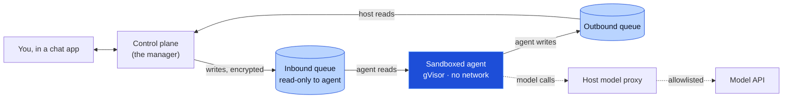
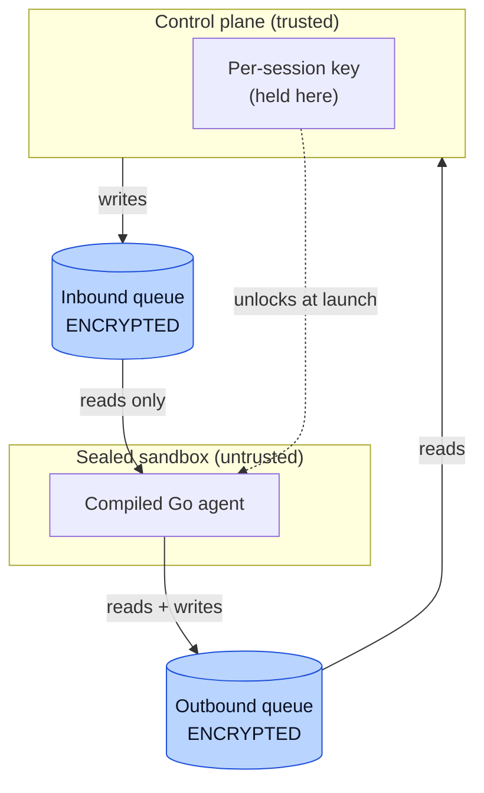
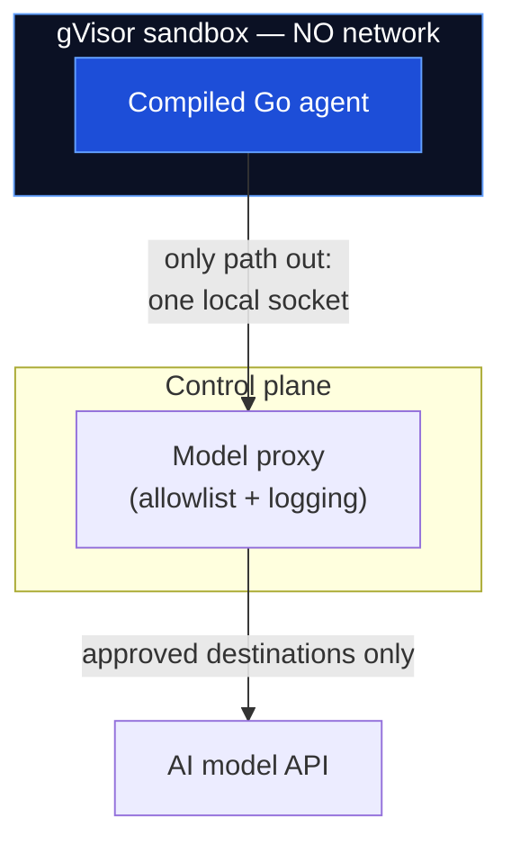
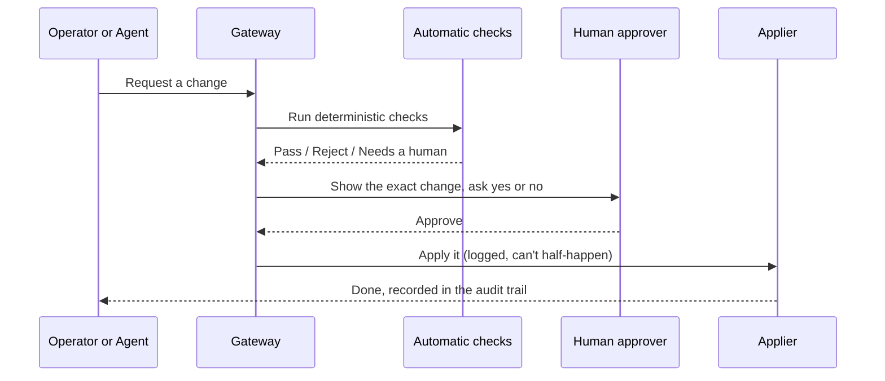
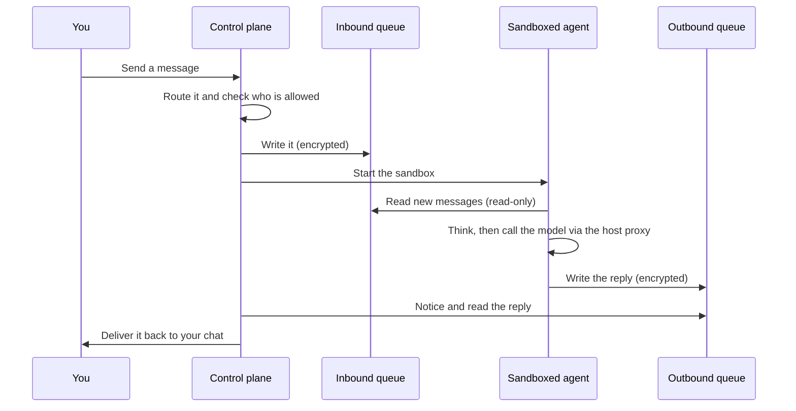

# IronClaw, Explained

*A plain-language tour of the design — for builders and the curious alike.*

This document explains what IronClaw is and how it works, from the big picture down to the moving parts. It assumes you can read a little, but it does **not** assume you spend your days in security or distributed systems. Jargon is explained the first time it appears, and there's a glossary at the end.

---

## What IronClaw is, in one breath

IronClaw is a personal AI assistant platform that runs on **your own** machine. You talk to it through chat apps you already use, and behind the scenes it runs real AI agents that can read, write, schedule things, and reply to you.

Plenty of tools already do that. IronClaw's whole reason to exist is *how* it does it: **security first.** It treats the AI agent — and the sealed box it runs in — as something that could be tricked or turned against you at any moment, and it builds hard walls so that even a misbehaving agent can't reach your data or your machine.

> **Jargon: agent.** An "agent" is an AI model that has been given tools and told to act on its own toward a goal, not just answer one question. When this document says "the agent," it means the AI brain handling one conversation.

> **Jargon: self-hosted.** It runs on a computer you control, not on someone else's cloud. Your conversations and data stay with you.

---

## The core belief: isolation you can prove

A lot of self-hostable AI tools say they're "secure because the agent runs in a sandbox." The problem is that the sandbox usually leaks: the main program quietly trusts whatever the agent sends back, the agent can often edit its own settings or code, and a single cleverly-worded message can talk the AI into doing something it shouldn't.

IronClaw starts from the opposite assumption: **assume the agent is already compromised, and make sure it still can't hurt you.** Everything in the design follows from four promises.

1. **The agent can't turn on itself** — it has no way to rewrite its own code or quietly expand its own powers.
2. **You stay in control of every change** — nothing about an agent changes without a human seeing it and approving it.
3. **Your data stays sealed** — every conversation is encrypted, even from the agent running it isn't given more than it needs.
4. **Nothing escapes the box** — each agent is locked in a sandbox with no way to leak your data out.

Here is the whole system at a glance:

> **In plain terms:** Your message reaches the **control plane** (the always-on manager). It writes the message, encrypted, into an "inbox" file the agent can only *read*. The sealed agent thinks, writes its reply into an "outbox" file, and the manager sends it back to you. The agent has no internet of its own — even when it needs the AI model, that call is routed through the manager.

---

## What we actually defend against

Security is easier to trust when it's concrete. Each defense in IronClaw kills a specific way an attacker could hurt you:

| The attack | In plain words | How IronClaw stops it |
|------------|----------------|------------------------|
| **Self-modification** | The agent rewrites its own code or rules | It's a compiled program — there's no source code inside the box to edit |
| **Silent setting changes** | Settings get changed behind your back | Every change must be shown to a human and approved first |
| **Data theft at rest** | Someone steals the disk and reads everything | All conversation files are encrypted |
| **Exfiltration / escape** | The agent leaks your data out, or breaks out of its box | The box has no network and a hardened wall around it |
| **Prompt injection → privilege** | A sneaky message tricks the AI into a dangerous action | The manager never trusts the agent; privileged actions go through approval |

> **Jargon: prompt injection.** Hiding instructions inside ordinary-looking content (a chat message, a web page, an email) to trick the AI into doing the attacker's bidding. It's the number-one way AI agents get abused.

---

## The cast of characters

IronClaw has two programs. They are both written in **Go** and shipped as compiled binaries. They never share memory and never call each other directly — they only leave notes for each other in encrypted files.

| Who | Where it runs | Job |
|-----|---------------|-----|
| **Control plane** | Your machine, always on | Receives chats, routes them, starts/stops sandboxes, delivers replies, holds the keys, runs the approval gateway |
| **Sandboxed agent** | Inside a sealed box, one per conversation | Reads its inbox, calls the AI model, writes its outbox |

> **Jargon: Go (the language).** A programming language that compiles to a single self-contained binary. The key security win: a compiled binary has **no readable source code inside it**, so the agent literally cannot open and rewrite "itself" the way a script-based agent could.

> **Jargon: control plane.** The always-on manager that orchestrates everything. It's the only component you trust; everything else is treated as suspect.

---

## The spine: two encrypted queues

The two programs talk **only** through a pair of files per conversation. This is the entire connection between them — no hidden channels.

> **Jargon: SQLite.** A database that is just a single file on disk, with no separate server to run. IronClaw uses it because passing one file between the manager and a sealed box is simple and safe.

> **Jargon: queue.** A list of messages waiting to be handled, in order. The "inbound queue" is the agent's to-do list; the "outbound queue" is its outbox.

Three things make this safe:

**1. Both files are encrypted.** If someone steals the disk, makes a backup copy, or pokes around the filesystem, the conversations are unreadable scrambled bytes.

> **Jargon: encryption at rest.** Scrambling data while it sits on disk so it's useless without the key. "At rest" means "while stored," as opposed to "in transit" (while moving over a network).

**2. Each conversation has its own key.** The key for one conversation can't unlock any other. So even if one agent is fully compromised, it gets nothing belonging to your other conversations.

> **Jargon: key.** A secret value used to lock (encrypt) and unlock (decrypt) data. IronClaw gives every session its own key, held by the control plane and handed to that one sandbox only.

**3. The agent can only read its inbox.** This "read-only inbound" rule is enforced **three different ways** at once, so a bug in any one layer doesn't open the door: the agent's code has no method that can write the inbox; the database is opened in read-only mode; and the file is mounted read-only by the operating system.

> **In plain terms:** Think of two people sharing a locked notebook through a slot. The manager writes on the left pages, the agent may only *read* them; the agent writes on the right pages, the manager reads those. Both halves are written in a cipher only those two share, and every conversation uses a different cipher.

---

## The wall: how the agent is boxed in

Encryption protects the files. A second layer protects the *running* agent — the sandbox itself.

- **Containerized under gVisor.** Each agent runs in a container, and that container is wrapped by gVisor — an extra security layer that sits between the agent and the real computer and intercepts what it tries to do.

> **Jargon: container.** A lightweight sealed box that runs a program in isolation, with its own filesystem and only the access you explicitly grant.

> **Jargon: gVisor.** A "guard" layer around a container. Normally a container talks fairly directly to the host computer's core (its kernel); gVisor stands in the middle and handles those requests itself, so the agent never touches the real kernel directly. It's a much stronger wall than a plain container.

- **No network of its own.** The sandbox has no internet access at all. Its only way out is a single local pipe to the control plane.

> **Jargon: unix socket.** A private local "pipe" two programs on the same machine use to talk. It's not the internet — nothing outside the machine can reach it.

- **Even AI model calls are chaperoned.** When the agent needs to call the AI model, the request goes through a **proxy** run by the control plane, which only allows approved destinations and can log or limit what passes. So the one outbound path is fully supervised.

> **Jargon: proxy.** A middleman that forwards requests on your behalf and can inspect, filter, or block them. Here it makes sure the agent can reach the AI model and nothing else.

> **Why this matters:** The most common way to steal data from an AI agent is to trick it into *sending* the data somewhere. If the agent has no open door to the internet, there's nowhere to send it.

---

## The gate: nothing changes without a human

This is the heart of IronClaw's "you stay in control" promise. Anything that changes what an agent *is* or *can do* — its instructions, its tools, its installed software, who it talks to, its permissions — must pass through a single **gateway**.

What makes this trustworthy:

- **It's deterministic, not a judgment call.** The automatic checks are plain rules with predictable yes/no answers — never the AI deciding whether to trust itself.

> **Jargon: deterministic.** Same input always gives the same result. The opposite of "it depends" — there's no guesswork or AI opinion involved in the gate.

- **A human always sees the real change.** The approval shows exactly what will happen — the full command, not a vague summary — so you can't be tricked into approving something dangerous that's hidden behind friendly wording.

- **Everything is recorded.** Every request, decision, and result is written to an audit trail, so there's always a record of who changed what and when.

> **Jargon: audit trail.** A permanent log of actions and decisions, kept so you can review later exactly what happened.

- **It's ready to grow.** Today the rule is simple: *every* change needs a human. The design lets you add automatic safety checks later — for example, an automated policy check that runs *before* the human, or that can auto-approve only the most trivial, clearly-safe changes — without rewriting how approvals work.

---

## Following a message end to end

Putting it together, here's a single message's journey:

Notice what the agent never does: it never reaches the internet directly, never writes its own inbox, never changes its own settings, and never holds a key to anyone else's conversation. Every powerful action is something the *control plane* does on its behalf, after its own checks.

---

## Inside the sandbox: the agent's loop

The agent's whole life is a simple loop: read the inbox, ask the AI model what to do, write the outbox, repeat. The AI's reasoning and its tool use are reimplemented natively in Go and speak to the model over the chaperoned proxy connection.

Crucially, the agent has **no self-modification tools**. There is no "install software" or "add a new integration" button inside the box. When the agent genuinely needs a new capability, it doesn't act — it files a change request that goes to the gateway for a human to approve. Capability and action are kept separate by design.

> **Jargon: model provider.** A swappable plug for "which AI to call." IronClaw defines a clean interface so the underlying model can be changed without touching the rest of the system.

---

## Reaching it safely from afar

Because IronClaw runs on your own machine, you need a safe way to manage it remotely. IronClaw exposes its control panel **only over a private network mesh (Tailscale)** — there is no public door open to the internet. Only devices you've explicitly added to your private network can even reach the controls.

> **Jargon: Tailscale / tailnet.** A tool that builds a small private network ("tailnet") between just your own devices, wherever they are. To anyone else, the control panel simply doesn't exist on the public internet.

---

## Built to be extended

Two parts of IronClaw are deliberately pluggable, so the project can grow without risky rewrites:

- **The model provider** — change which AI model powers the agents.
- **The isolation layer** — gVisor is the default sandbox today; the same interface leaves room for even stronger boxes (such as lightweight virtual machines) in the future.

Everything is open source under the GNU AGPLv3 license, with a commercial license available for proprietary use.

---

## The security scorecard

| Pillar | What it is | Attack surface it removes |
|--------|------------|----------------------------|
| **Sealed runtime** | Compiled Go agent | Agent self-modification |
| **Approved by humans** | Mandatory change gateway | Silent setting changes |
| **Encrypted queues** | Per-session encrypted files, read-only inbox | Data theft at rest |
| **Sealed sandbox** | gVisor container, no network, chaperoned model calls | Data exfiltration and escape |
| **Private control panel** | Access over a private mesh only | Remote attacks on the controls |

The throughline: **treat the agent as untrusted, and make the security boundary something you can prove — not something you take on faith.**

---

## Glossary

| Term | Meaning |
|------|---------|
| **Agent** | The AI acting on its own with tools, handling one conversation. |
| **Audit trail** | A permanent log of who changed what and when. |
| **At rest (encryption)** | Scrambling data while it's stored on disk. |
| **Container** | A sealed, isolated box that runs the agent away from your real machine. |
| **Control plane** | The always-on manager that orchestrates everything; the one trusted part. |
| **Deterministic** | Same input always gives the same result; no guesswork. |
| **Exfiltration** | Sneaking data out to somewhere it shouldn't go. |
| **Gateway** | The single checkpoint every change must pass through, with human approval. |
| **gVisor** | A guard layer between a container and the real computer; a stronger wall. |
| **Go** | A language that compiles to a single binary with no readable source inside. |
| **Key** | A secret used to encrypt and decrypt data; one per conversation here. |
| **Model provider** | A swappable choice of which AI model to call. |
| **Prompt injection** | Hidden instructions in content meant to trick the AI. |
| **Proxy** | A supervised middleman that forwards (and can filter) requests. |
| **Queue** | An ordered list of waiting messages; the agent's inbox and outbox. |
| **Sandbox** | The sealed box one agent runs in. |
| **Self-hosted** | Runs on a machine you control, not someone else's cloud. |
| **SQLite** | A database that's just a single file, no server needed. |
| **Tailscale / tailnet** | A private network between only your own devices. |
| **Unix socket** | A private local pipe between two programs on the same machine. |
