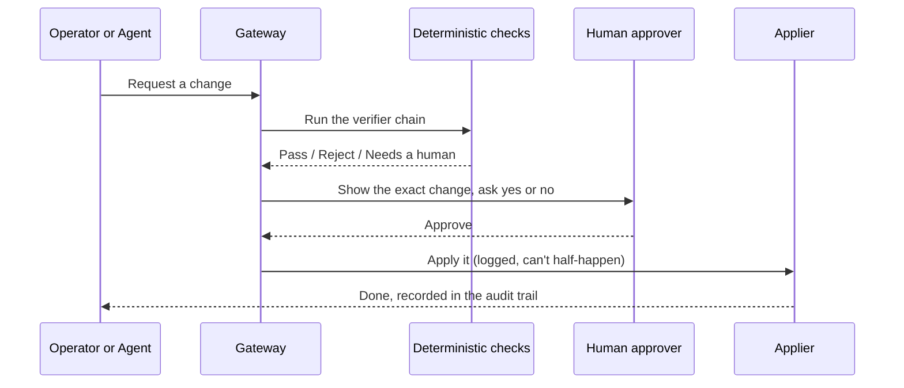

The gateway is the heart of IronClaw's "you stay in control" promise. Anything that changes what an agent
_is_ or _can do_ — its persona, its enabled tools, its installed packages, who it talks to (wiring), its
permissions, or its mounts — must pass through a single checkpoint and be approved by a human.



## What makes it trustworthy

- **It's deterministic, not a judgment call.** The verifier chain is plain rules with predictable yes/no
  answers — never the AI deciding whether to trust itself. The chain runs the mount-allowlist and
  package-name verifiers, the `create_agent` verifier (RFC-0004 — a new agent is always held for a human,
  never auto-approved), and ends at an **`always-require-human`** floor.
- **A human always sees the real change.** The approval shows exactly what will happen — the full change,
  not a vague summary — so you can't be tricked into approving something dangerous hidden behind friendly
  wording.
- **Everything is recorded.** Every submit, verdict, decision, and apply is written to an append-only
  audit log. No file is the source of truth — the gateway transaction is.
- **It's ready to grow.** Today the floor is simple: _every_ change needs a human. The design lets you add
  automatic policy checks _before_ the human, or RBAC and narrow auto-approval for the most trivial,
  clearly-safe changes — without rewriting how approvals work.

## The change kinds

Every mutation is one of six kinds:

| Kind | What it changes |
|---|---|
| `persona` | The agent's name and system persona |
| `enabled_tools` | Which in-sandbox tools the agent may use |
| `packages` | Host-curated package/skill grants |
| `wiring` | Which channels/messaging groups an agent group is connected to |
| `permissions` | Roles and membership (owner / admin / member) |
| `mounts` | Filesystem mounts available to the sandbox |

## Driving it

Submit and decide changes with the [`ironctl`](/site/reference/cli) CLI, a thin client of the
[control-plane API](/site/reference/api):

```sh
ironctl change submit --kind persona --group default --by alice
ironctl change pending
ironctl change approve <change-id> --by alice
ironctl audit --limit 20
```

The [Approvals guide](/site/guides/approvals) walks through the full submit → approve → audit loop.
