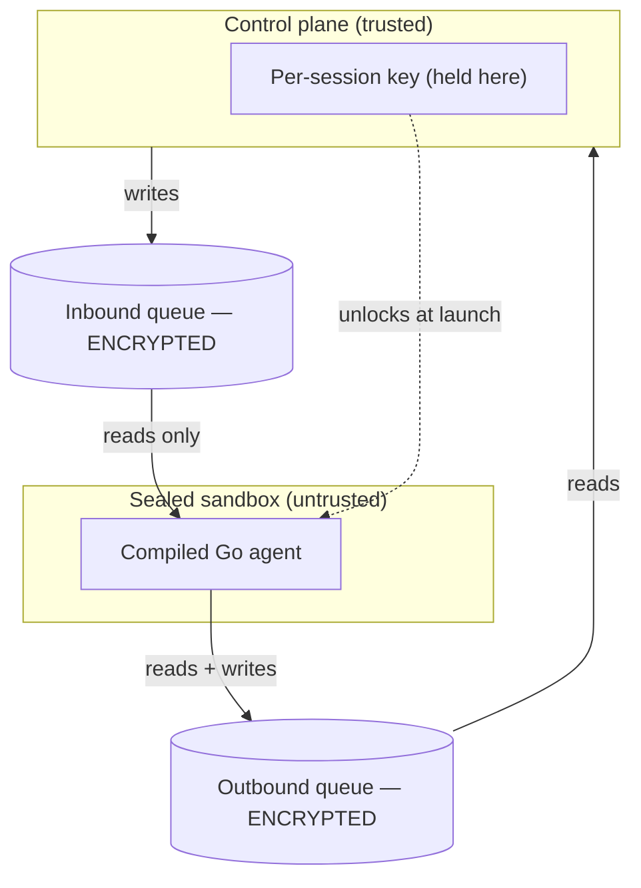
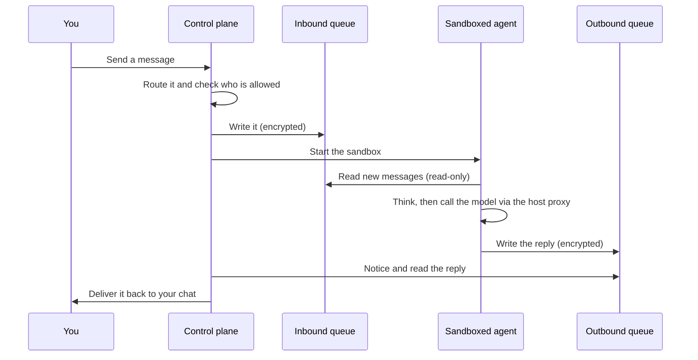

IronClaw has **two programs**, both written in Go and shipped as compiled binaries. They never share
memory and never call each other directly — they only leave notes for each other in encrypted files.

| Who | Where it runs | Job |
|-----|---------------|-----|
| **Control plane** | Your machine, always on | Receives chats, routes them, starts/stops sandboxes, delivers replies, holds the keys, runs the approval gateway |
| **Sandboxed agent** | Inside a sealed box, one per conversation | Reads its inbox, calls the AI model, writes its outbox |

The control plane is the only component you trust; everything else is treated as suspect.

## The spine: two encrypted queues

The two programs talk **only** through a pair of encrypted SQLite files per conversation. This is the
entire connection between them — there are no hidden channels.

Three things make this safe:

1. **Both files are encrypted at rest.** Steal the disk and the conversations are unreadable scrambled
   bytes.
2. **Each conversation has its own key.** One session's key can't unlock any other — so a fully
   compromised agent gets nothing belonging to your other conversations.
3. **The agent can only read its inbox.** This read-only-inbound rule is enforced **three ways at once**:
   the agent's Go code has no method that can write the inbox, the database is opened read-only, and the
   file is mounted read-only by the OS. A bug in any one layer doesn't open the door.

<Tip>
Seq parity is enforced in the queue writers: the host writes **even** sequence numbers, the sandbox writes
**odd** — so a host writer and a sandbox reader of the same session can never collide.
</Tip>

## Following a message end to end

Notice what the agent never does: it never reaches the internet directly, never writes its own inbox,
never changes its own settings, and never holds a key to anyone else's conversation. Every powerful action
is something the **control plane** does on its behalf, after its own checks.

## Inside the sandbox: the agent's loop

The agent's whole life is a simple poll loop: read the inbox, ask the AI model what to do, write the
outbox, repeat — touching a heartbeat file each pass so the host's sweep can detect a stuck sandbox. The
reasoning and tool use are reimplemented natively in Go and speak to the model only over the chaperoned
proxy connection.

Crucially, the agent has **no self-modification tools**. There is no "install software" or "add an
integration" button inside the box. When the agent genuinely needs a new capability, it doesn't act — it
files a change request that goes to the [gateway](/site/concepts/gateway) for a human to approve.
Capability and action are kept separate by design.

## Where to go next

<CardGroup cols={2}>
  <Card title="The gateway" icon="user-check" href="/site/concepts/gateway">
    Why nothing changes without a human.
  </Card>
  <Card title="Sandbox isolation" icon="box" href="/site/concepts/sandbox-isolation">
    gVisor, <code>network=none</code>, and the chaperoned model proxy.
  </Card>
</CardGroup>
