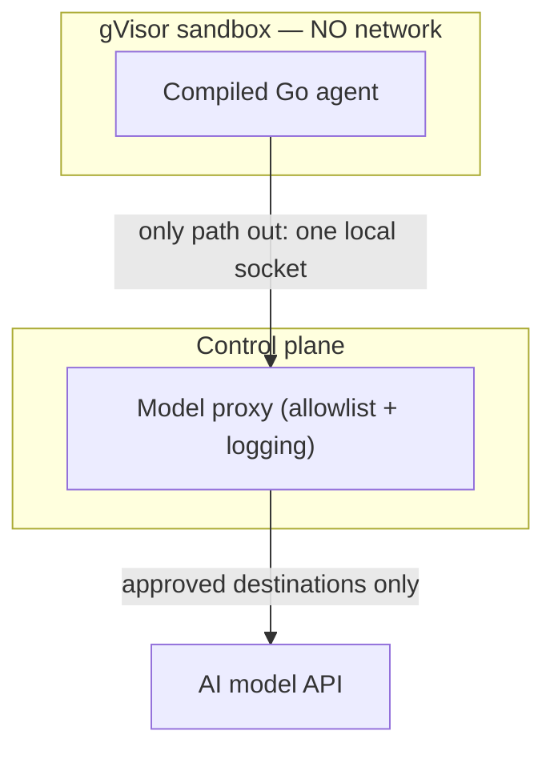

Encryption protects the files; a second layer protects the _running_ agent — the sandbox itself.

## The hardened box

Each agent runs in a per-session container whose OCI spec is built host-side (`BuildOCISpec`) to be
hostile to escape:

- **gVisor (`runsc`).** A user-space kernel sits between the agent and the host kernel and services its
  syscalls itself, so the agent never touches the real kernel directly. The isolator is pluggable — the
  same `Isolator` interface leaves room for stronger boxes (e.g. lightweight VMs / Kata) later.
- **`network=none`.** The network namespace is omitted entirely. The sandbox has no internet of its own;
  its only way out is a single local unix socket to the control plane.
- **Least privilege.** All capability sets are empty, `no_new_privs` is set, the process runs as a
  non-root uid/gid inside a user namespace, and the root filesystem is read-only with only a writable
  `/workspace`.
- **Queue mounts match the trust model.** The inbound queue is bound **read-only**, the outbound queue
  **read-write**, and the model-proxy socket is bound in. The per-session key is delivered via tmpfs at
  launch — never an env var, never baked into the image.

## Chaperoned model calls

When the agent needs the AI model, the request goes through a **model proxy** run by the control plane.
The proxy:

- only allows **approved destinations** (an allowlist — e.g. `api.anthropic.com`),
- **injects the provider credential host-side**, so the API key never enters the sandbox,
- applies **rate caps** and **per-request audit**, feeding metrics, and
- **redacts secrets** from responses.

<Warning>
The most common way to steal data from an AI agent is to trick it into _sending_ the data somewhere. With
`network=none` and a single allowlisted egress path, there is nowhere to send it.
</Warning>

## Image verification

Before a sandbox launches, its rootfs is provisioned through a pluggable provisioner that **verifies the
image digest/signature against a trust policy** before unpack. A live launch needs `runsc` and a
provisioned, signed image present on the host — see [Production](/site/self-hosting/production).
