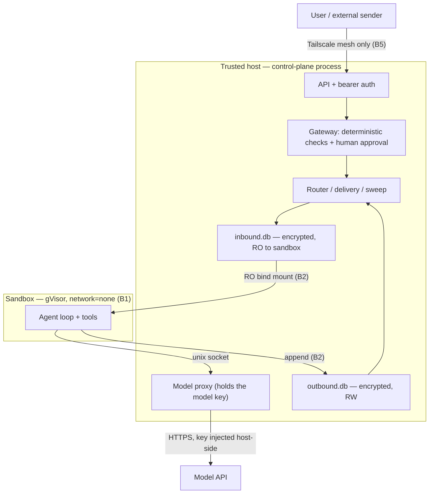

IronClaw's security model starts from one assumption: **the agent is already compromised, and it still
can't hurt you.** Everything else follows.

## Scope and core assumption

- **Trusted:** the host OS and root, the control-plane binary, the maintainer, the gVisor runtime, and the
  integrity of the build/release pipeline.
- **Untrusted:** the sandboxed agent and everything it emits (tool calls, outbound messages, capability
  requests), every inbound chat message, and every byte returned by an approved external API.
- **Goal:** a fully-compromised agent still cannot read another session's data, change its own
  configuration, reach the host filesystem or arbitrary network, obtain a host-held secret, or bypass the
  human-approval gateway.

## Assets

| Asset | Why it matters |
|---|---|
| **User conversation data** | At rest in the per-session queues; the primary confidentiality target. |
| **Cross-session isolation** | One session must never read another's queue or workspace. |
| **Host secrets** | The model API key, the keystore master key, per-session queue keys, the API bearer token — none may reach the sandbox. |
| **Gateway integrity** | No persona/tools/packages/wiring/permissions/mounts/`create_agent` change applies without a human decision. |
| **The host machine** | Filesystem, processes, and network reachability of the box. |
| **Model & egress budget** | Cost and rate of model and approved-egress calls. |

## Trust boundaries

| Boundary | What it is |
|---|---|
| **B1 — host ↔ sandbox** | The gVisor wall. The only crossings are host unix sockets (model proxy, opt-in egress broker) and the bind-mounted queue files. No NIC exists inside the sandbox. |
| **B2 — control-plane ↔ agent** | The per-session encrypted queue pair. Inbound is read-only to the agent; outbound is append-only. |
| **B3 — agent ↔ agent** | One agent group messaging another, and the approval-gated `create_agent` change (RFC-0004). |
| **B4 — egress broker ↔ network** | The bounded, deny-by-default relaxation of `network=none` for operator-approved external APIs. |
| **B5 — admin ↔ control-plane** | The mesh-only API plus bearer token. |

## Adversaries

| # | Adversary | Capability assumed |
|---|---|---|
| **A1** | Compromised sandbox agent (primary) | Full control of the agent loop. |
| **A2** | Malicious external sender | Any inbound chat content (the prompt-injection vector). |
| **A3** | Tailnet-adjacent attacker | A foothold on the mesh, can reach the API port. |
| **A4** | Offline / disk attacker | Can read the state directory and queue files at rest. |
| **A5** | Malicious approved-egress host | A host the operator added to the egress allowlist. |

A compromised host or root (**A0**) is **not** modeled — it is the trust anchor.

## What counts as a vulnerability

Anything that breaks an intended trust boundary, including: sandbox escape (gVisor/Kata) or any path that
lets a sandboxed agent reach the host beyond the sanctioned unix sockets; bypassing the mandatory
human-approval gateway; reading another session's encrypted queues or recovering keys; egress/model-proxy
allowlist bypass; control-plane API auth/RBAC bypass; secret leakage in logs, audit records, or forwarded
responses; and supply-chain weaknesses in the release/build pipeline.

## Non-goals (out of scope by design)

These are deliberate decisions, not gaps to fill:

- In-sandbox browser/network access, `install_packages`/self-modification, or a general arbitrary-API
  credential vault.
- Findings that require a malicious operator/maintainer, physical access, or a compromised host OS.
- Volumetric DoS and best-practice nitpicks without demonstrated impact.

## Reporting a vulnerability

**Do not open a public issue for a security vulnerability.** Use GitHub Private Vulnerability Reporting
(the repository's **Security → Report a vulnerability**) or message a maintainer on LinkedIn — [Omer Zamir](https://www.linkedin.com/in/omerzamir) or [Topaz Aharon](https://www.linkedin.com/in/topaz-aharon/). Maintainers
acknowledge within 3 business days and aim for coordinated disclosure within 90 days. See the full
[Security Policy](https://github.com/IronSecCo/ironclaw/security/policy) and the complete
[threat model](https://github.com/IronSecCo/ironclaw/blob/main/docs/threat-model.md) in the repository.
