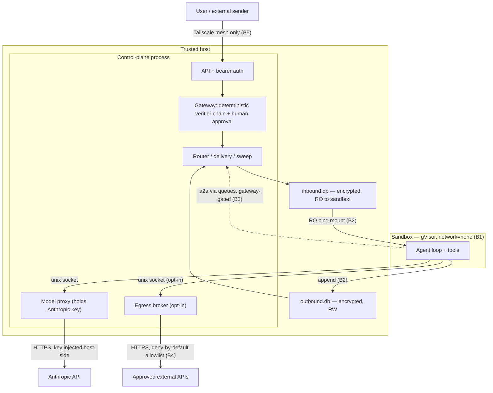

# Threat model

> Versioned with the code. Linked from the [README](../README.md) and
> [SECURITY.md](../SECURITY.md). The scope in §8 ("what counts as a
> vulnerability") is the reference the disclosure policy points back to.

IronClaw assumes the agent inside the sandbox is **potentially compromised** — by
prompt injection, a poisoned tool result, or a hostile model output — and designs
the trust boundary so that a compromised agent cannot escalate. The host is
trusted; the agent is not. Everything below follows from that single asymmetry.

## 1. Scope and core assumption

- **Trusted:** the host OS and root, the control-plane binary, the maintainer,
  the gVisor runtime, and the integrity of the build/release pipeline.
- **Untrusted:** the sandboxed agent and everything it emits (tool calls,
  outbound messages, capability-change requests), every inbound chat message, and
  every byte returned by an approved external API.
- **Goal:** a fully-compromised agent still cannot read another session's data,
  change its own configuration, reach the host filesystem or arbitrary network,
  obtain a host-held secret, or bypass the human-approval gateway.

What is explicitly *not* in scope (a compromised host, a malicious maintainer,
physical attacks, model "alignment") is enumerated in §8–§9 so that disclosure
stays sane.

## 2. Assets

| Asset | Why it matters |
|-------|----------------|
| **User conversation data** | At rest in the per-session queues; the primary confidentiality target. |
| **Cross-session isolation** | One session (or agent group) must never read another's queue or workspace. |
| **Host secrets** | The Anthropic API key, the keystore master key, per-session 256-bit queue keys, the API bearer token — none may reach the sandbox. |
| **Gateway integrity** | The guarantee that no persona/tools/packages/wiring/permissions/mounts/create_agent change applies without a human decision. |
| **The host machine** | Filesystem, processes, and network reachability of the box the control-plane runs on. |
| **Model & egress budget** | Cost and rate of model calls and approved-egress calls. |

## 3. Trust boundaries and data flow

The boundaries this document analyzes with STRIDE:

- **B1 — host ↔ sandbox:** the gVisor wall. The only crossings are two host unix
  sockets (model proxy, and the opt-in egress broker) and the bind-mounted queue
  files. No NIC exists inside the sandbox.
- **B2 — control-plane ↔ agent:** the per-session encrypted queue pair. Inbound is
  read-only to the agent; outbound is append-only.
- **B3 — agent ↔ agent (a2a):** one agent group messaging another, and the
  approval-gated `create_agent` change (RFC-0004).
- **B4 — egress broker ↔ network:** the bounded relaxation of `network=none` for
  operator-approved external APIs (see §7).
- **B5 — admin ↔ control-plane (supporting):** the mesh-only API plus bearer token.

## 4. Adversaries

| # | Adversary | Capability assumed |
|---|-----------|--------------------|
| **A1** | Compromised sandbox agent (primary) | Full control of the agent loop: arbitrary tool calls, outbound messages, and change requests. |
| **A2** | Malicious external sender | Can send any inbound chat content (the prompt-injection vector that produces A1). |
| **A3** | Tailnet-adjacent attacker | Has a foothold on the private mesh and can reach the API port. |
| **A4** | Offline / disk attacker | Can read the state directory and queue files at rest. |
| **A5** | Malicious approved-egress host | A host the operator added to the egress allowlist that then behaves adversarially. |

A compromised host or root (A0) is **not** modeled — it is the trust anchor (§1).

## 5. STRIDE by boundary

Each table is a STRIDE pass (Spoofing, Tampering, Repudiation, Information
disclosure, Denial of service, Elevation of privilege) for one boundary, with the
control that addresses it.

### B1 — host ↔ sandbox (the gVisor wall)

| STRIDE | Threat | Mitigation |
|--------|--------|------------|
| S | Agent impersonates the host/model to itself | Host services are reached only over host-owned unix sockets bound into the sandbox; the agent cannot forge the other end. |
| T | Agent edits its own runtime/source to change behavior | Compiled Go binary, no interpreter, read-only rootfs; there is no source in the box to rewrite. |
| R | Agent denies an action it took | Every change request and model/egress call is audited host-side, outside the sandbox's reach. |
| I | Agent reads a host secret (Anthropic key, master key) | Secrets stay host-side; the model proxy injects the API key into the outbound call — the sandbox never sees it. Session keys arrive via tmpfs at launch, never an env var or the image. |
| D | Agent exhausts host resources | gVisor resource limits; host respawn crash-loop backoff; sweep reclaims stale sandboxes. |
| E | Sandbox escape to the host | gVisor (runsc): dropped capabilities, `no_new_privs`, non-root user namespace, read-only rootfs. |

### B2 — control-plane ↔ agent (the encrypted queues)

| STRIDE | Threat | Mitigation |
|--------|--------|------------|
| S | Agent writes a message attributed to another sender/session | The host owns routing and stamps identities; the agent only appends to its own outbound queue. |
| T | Agent writes the inbound queue it should only read | Three independent layers: Go interface segregation (no write method), `PRAGMA query_only`, and a read-only OS bind mount. |
| R | Disputed message history | Append-only queues with monotonic sequence; host-side audit. |
| I | Cross-session / at-rest queue reads (A4) | Per-session encrypted SQLite (raw 256-bit key, pinned cipher params); no plaintext on disk; wrong key fails closed. |
| D | Agent floods the outbound queue | Sweep + delivery backpressure; per-session isolation bounds blast radius to one session. |
| E | Agent uses the queue to drive a privileged host action | Queues carry data, not commands; privileged needs must take the gateway path (B3 / change requests), which the queue cannot shortcut. |

### B3 — agent ↔ agent (a2a + create_agent)

| STRIDE | Threat | Mitigation |
|--------|--------|------------|
| S | Agent spoofs another agent group's identity | Group identities are host-assigned in the registry; a2a routing is mediated by the control-plane, not peer-to-peer. |
| T | Agent tampers with another group's config via a message | a2a is data only; config changes for any group still require a gateway-approved ChangeRequest. |
| R | Untraceable agent-to-agent traffic | a2a flows through host routing/delivery and is audited like any other message. |
| I | Agent reads another group's data by messaging it | Delivery respects destination allowlists and access checks; no shared queue is exposed. |
| D | Agent fans out messages to amplify load | Routing/delivery is host-controlled; sweep and per-session limits bound it. |
| E | Agent provisions a new, over-privileged agent (`create_agent`) | `create_agent` is privileged and **always** routed through the gateway's mandatory human-approval floor — a new agent is a new trust principal and is never auto-approved (RFC-0004). |

### B4 — egress broker ↔ network

| STRIDE | Threat | Mitigation |
|--------|--------|------------|
| S | Agent reaches an unapproved host by spoofing a target | Forwarding is matched against an explicit host allowlist; an unapproved host returns 403. |
| T | Agent rewrites the egress destination/allowlist | The sandbox cannot mutate the allowlist; additions/removals clear the gateway and are logged. |
| R | Deniable exfiltration | Every request — allowed or denied — emits an audit record (host, path, method, status, byte counts, duration). |
| I | Exfiltration to an attacker-controlled endpoint | Deny-by-default allowlist; empty allowlist forwards nothing; HTTPS only. Residual risk to *approved* hosts is accepted and bounded (see §7). |
| D | Agent saturates an approved host / the link | Per-request audit makes abuse visible; rate caps are tracked future work (§9). |
| E | Broker is used to launder access to a host-held credential | The broker injects **no** host secrets and forwards only the request's own headers — it cannot grant access the sandbox does not already hold. Not a credential vault (an explicit non-goal). |

### B5 — admin ↔ control-plane (supporting)

Spoofing/EoP from the network: the API binds **only** to the Tailscale interface
(no public port), and an optional bearer token (constant-time compared) means a
foothold on the tailnet alone (A3) is not enough to drive the gateway. The
`/healthz` and `/readyz` probes are the only unauthenticated endpoints.

## 6. Privilege matrix

What each principal can do. `gateway` = only via a human-approved ChangeRequest.

| Capability | Sandbox agent | Control-plane | Admin (human) | External sender | Approved egress host |
|---|---|---|---|---|---|
| Read its own session queue | ✓ | ✓ | — | — | — |
| Read another session's queue | ✗ | ✓ | — | ✗ | ✗ |
| Write the outbound queue | append-only | ✓ | — | ✗ | ✗ |
| Write the inbound queue | ✗ | ✓ | — | via routing | ✗ |
| Change config (persona/tools/wiring/…) | request only → `gateway` | apply after approval | approve/reject | ✗ | ✗ |
| Provision a new agent (`create_agent`) | request only → `gateway` | apply after approval | approve/reject | ✗ | ✗ |
| Reach the model | via host proxy | ✓ (holds key) | — | — | — |
| Reach an external network host | only approved hosts, via broker | ✓ | configures allowlist | ✗ | n/a |
| Reach the host filesystem | ✗ (RO rootfs + bind mounts) | ✓ | ✓ | ✗ | ✗ |
| Hold a host secret | ✗ | ✓ | ✓ | ✗ | ✗ |

## 7. Egress broker

The egress broker (`internal/host/egress`) lets an agent reach **operator-approved
external APIs** beyond the model host. It is a deliberate, bounded relaxation of
the original "model host only" posture, designed to keep the trust boundary
intact:

- **The sandbox stays `network=none`.** It never gets a NIC. The broker is a
  second host unix socket bound into the sandbox (alongside the model-proxy
  socket); every byte still crosses a host choke point. The egress socket is
  bound **only** when `SandboxSpec.EgressSocket` is set, so the default
  (`HardenedSpec`) remains sealed to the model proxy alone.
- **Deny by default.** The broker forwards only to hosts on an explicit
  allowlist. An empty allowlist forwards nothing; an unapproved host returns 403.
  In production the allowlist is mutated only after the change clears the
  gateway's human approval (wired by the daemon).
- **Audited.** Every request — allowed or denied — emits an audit record (host,
  path, method, status, byte counts, duration). Allowlist additions/removals are
  logged.
- **HTTPS only**, and **not a credential vault** (an explicit IronClaw non-goal):
  the broker injects no host-held secrets and forwards the request's own headers,
  so it cannot launder access to a credential the sandbox does not already hold.
- **Agent surface:** the opt-in `http_fetch` sandbox tool, registered only when an
  egress socket is configured.

**Threat-model review sign-off:** reviewed and approved by the maintainer (sole
CODEOWNER, `@ToPmit26`) on 2026-06-16, via the decision to un-gate T-111 and wire
egress live. Residual risk accepted: a compromised agent can exfiltrate to / pull
from any *approved* host; this is mitigated by deny-by-default approval and full
per-request audit, and bounded by keeping the sandbox itself network-less.

## 8. What counts as a vulnerability

For disclosure (see [SECURITY.md](../SECURITY.md)), a finding **is** a vulnerability
if it lets the untrusted agent or an external sender cross a boundary above —
concretely, if it allows any of:

- escaping the sandbox to the host (B1);
- reading another session's queue/workspace, or any at-rest plaintext (B2);
- applying a configuration or `create_agent` change without human approval, or
  otherwise bypassing the gateway (B2/B3);
- reaching the host filesystem, or a network host that is not on the approved
  egress allowlist (B1/B4);
- causing a host-held secret (Anthropic key, master/session keys, API token) to
  become readable inside the sandbox (B1);
- tampering with or forging audit/queue records (R across boundaries).

A finding **is not** a vulnerability (so please don't file it as one) if it is:

- the model saying something wrong, biased, or "jailbroken" — that is agent
  *behavior*, not a boundary breach (the threat model already assumes a hostile
  agent);
- data sent to a host the operator explicitly approved on the egress allowlist —
  that is the feature working as designed (§7);
- anything that requires a compromised host, root, or the maintainer (A0), or
  physical access — outside the trust model (§1);
- a denial-of-service that requires host privileges to trigger;
- the agent failing to complete a task.

## 9. Non-goals and documented future work

Intentional non-goals of the sealed / `network=none` design (do not file these as
gaps): in-sandbox web/browser access, package installation / self-modification, and
a credential vault **built into the egress broker / trusted core** (the broker is
never a secret sink — B4-E). Request-time credential injection via a *separate*
host-side principal behind the broker — the vault-behind-broker integration — is now
supported under host governance (see §11); building injection *into* the broker
stays the non-goal. (Multiple model-provider backends were previously listed here
too; they are now supported under host governance — see §10.)

Documented future hardening: per-host egress rate caps; a Kata isolation backend
behind the same `Isolator` interface; automated (non-human) gateway approval for
low-risk change kinds, with the mandatory-human floor staying the default.
(Response-secret redaction for the egress broker — the T-107 model-proxy pattern
applied to egress — is now implemented for the vault path; see §11.)

## 10. Multi-provider model egress

The model proxy (`internal/host/modelproxy`) supports **per-agent-group model
provider selection** beyond the original Anthropic-only posture: a group may run on
Anthropic (the default), OpenAI, or OpenRouter. This was a §9 non-goal; it is now
supported as a deliberate, host-governed relaxation that keeps the trust boundary
intact — it reuses the exact same choke point and controls as the single-provider
proxy:

- **The sandbox stays `network=none`.** Every provider is reached through the *same*
  host model-proxy unix socket; no new socket and no NIC are added. The
  sandbox-side `provider` abstraction (`internal/sandbox/provider`) only ever dials
  that socket, addressing the real upstream host so the proxy's allowlist matches
  and routes it.
- **The host is still the sole authenticator.** Each provider's credential lives
  only on the host (`ANTHROPIC_API_KEY`, `OPENAI_API_KEY`, `OPENROUTER_API_KEY`);
  the proxy strips any sandbox-supplied auth and injects the credential matching the
  upstream host (`MultiInjector`). The sandbox holds no provider key — the §1 "host
  secret" guarantee is unchanged for every provider.
- **Deny by default, and only what the operator enabled.** A provider is reachable
  only when its credential is present in the control-plane environment: the proxy
  allowlists exactly the enabled providers' hosts, so an un-configured provider
  returns 403 like any other unapproved host. Provider *selection* for a group is
  registry config (`AgentGroup.Provider`/`Model`), consumed at sandbox launch; a
  change to it is a gateway-gated configuration change like any other.
- **Audited uniformly.** The per-request audit record (host, path, method, status,
  byte counts, duration) and the rate cap apply to every provider, not just
  Anthropic — multi-provider egress is as observable as the original path. Each
  provider's key is also registered for response-secret redaction.

**Threat-model review sign-off:** reviewed and approved by the maintainer (sole
CODEOWNER) on 2026-06-17, via the decision to un-gate T-233 and support per-group
providers. Residual risk accepted: enabling a provider adds one egress destination
and one host-held credential. This is bounded exactly as the egress broker's risk
(§7) is — deny-by-default enablement, full per-request audit, host-only credentials,
and a sandbox that remains network-less — so it introduces no boundary crossing that
the single-provider proxy did not already define.

## 11. Credential vault behind the broker

Long-running agents that call real third-party APIs need credentials for them.
IronClaw supports **request-time credential injection** — an agent references a
credential by LOGICAL NAME (`vault://<cred>/<path>`) and never holds a key — without
weakening either of its two most sensitive components. The design is *integrate, not
build-into-the-broker*: the secret-holding **injector is a separate host-side
principal the broker forwards TO**, never the broker itself.

- **The secret never enters the sandbox.** The agent addresses a credential by name
  and receives only the upstream response; no plaintext credential is ever in the
  sandbox's address space — the §1 "host secret" guarantee holds for vaulted
  credentials exactly as for the model key.
- **The secret never enters the egress broker — B4-E is unchanged.** The broker
  forwards a `vault://` request's own bytes, by name, to the configured host-local
  injector endpoint, injecting nothing (`internal/host/egress/vault.go` strips any
  client `Authorization` and adds only the logical credential *name*). The injector
  — a distinct OS principal — is the sole holder of the credential and the only
  component that attaches it, host-side. The broker's specification and blast radius
  (§7) are untouched: it is still "not a credential vault".
- **Deny by default, gateway-gated policy.** "Which agent group may use which
  credential against which host" is host-side config (`internal/host/registry`
  `VaultPolicyStore`), read-only to the sandbox and mutated only through the
  gateway's human-approval path — a policy change is a capability change like any
  other. An unlisted group/credential/host is refused, and the injector endpoint is
  itself deny-by-default on the broker allowlist.
- **Audited end-to-end.** A host-generated correlation id
  (`internal/host/egress/correlate.go`) joins the broker's per-request audit to the
  injector's injection/policy audit, so a single credential use is traceable across
  both principals (the §5 Repudiation control, extended). The id is host-authored: a
  sandbox-supplied value is overwritten, so audit correlation cannot be forged.
- **Redaction backstop.** Even though the broker holds no credential, configured
  secrets are scrubbed from responses on the broker→sandbox hop
  (`internal/host/egress/redact.go`, the T-107 model-proxy pattern) so an injected
  credential can never echo back if an upstream reflects it.

Building a credential vault *into* the egress broker or the trusted core — making
the broker a secret sink — remains a non-goal (§9). The value here comes precisely
from keeping injection in a separate, swappable principal: IronClaw's minimal
in-tree injector by default, or an operator-vetted external vault (e.g. OneCLI)
behind the same broker→injector contract.

**Threat-model review sign-off:** reviewed and approved by the maintainer (sole
CODEOWNER) on 2026-06-17, via the needs-human decision to BUILD the vault-behind-
broker integration (credential-vault spike, approved 2026-06-17) and the spike-2
resolution closing its open questions. Residual risk accepted: a vaulted
call adds one host-local destination (the injector) and concentrates credentials in
that separate principal; this is bounded by deny-by-default per-group policy,
end-to-end audit correlation, the response-redaction backstop, and a broker and
sandbox that are otherwise exactly as specified — so it introduces no boundary
crossing beyond the injector principal the design intentionally adds.

## 12. Skills / extension system

A **skill** is a host-side, gateway-gated *capability bundle* — it declares the
persona text, the already-compiled tools, the egress hosts, and the read-only
assets an agent group should be granted. It is **data, not code**: a skill never
ships a script, interpreter, or post-install hook (the sealed-runtime pillar of
§1). This is the deliberate answer to the peers' extensibility (openclaw's
`SKILL.md` + ClawHub auto-install, nanoclaw's branch-copy) without reintroducing
either half of the `open + auto-install` vector those ecosystems were exploited
through.

### The skills boundary

- **Install is a gateway ChangeRequest, never a sandbox action.** The trigger is
  the host/admin CLI (`ironctl skill add`), not a sandbox tool. The host
  fetches + verifies + validates the manifest, then synthesizes **one**
  ChangeRequest bundling the declared grants. The change rides the
  existing verifier chain and the `AlwaysRequireHuman` floor exactly like any
  other capability change — never auto-approved. Even a future sandbox-side
  `request_skill` tool could only *emit* such a ChangeRequest: the agent may ask,
  only a human may grant (the `create_agent`/RFC-0004 posture, B3).
- **Apply touches config only.** On approval the change updates registry / egress
  allowlist / mount allowlist — it never writes the read-only rootfs or adds an
  executable. The install payload is structurally incapable of carrying a
  command, script, or rootfs path (enforced + tested).
- **Assets are read-only data.** A skill's bundled files mount at
  `/skills/<name>` with `nosuid,nodev,noexec`; they are read, never
  executed.

### Trust model for third-party skills

Third-party skill content is **untrusted by default** — the same posture as an
inbound chat message or an egress response (§1):

- **Curated host source, not an open marketplace.** Skills resolve only from a
  host-configured source (a pinned ref / operator-controlled registry), never an
  agent-supplied URL. `open + auto-install` is the vector; IronClaw keeps
  neither half.
- **Signature verification before display.** A skill whose signature does not
  verify against the configured trust root is refused at fetch time — it never
  reaches the approval step (minisign/ed25519, fail-closed).
- **Manifest validation fails closed.** Tools must be a subset of the compiled
  sandbox registry; egress entries must be bare hostnames (no wildcards); assets
  must be relative in-bundle paths. Any violation rejects the manifest before a
  ChangeRequest exists.
- **Every grant is explicit and human-approved.** Because a skill cannot run code,
  its only damage surface is the capabilities it requests — and each one is named
  in the manifest and shown to the approver in the change diff. A trojaned skill
  that quietly asks for `egress: evil.example.com` is visible and rejected, not
  discovered post-breach.

### Residual risk

The worst a hostile third-party skill can do is **request** privileges — which a
human sees in the diff and denies — and it can never execute code or self-install.
An approved-but-malicious skill is bounded by exactly the runtime controls a
hand-configured agent already has: `network=none`, read-only rootfs, dropped caps,
broker-mediated + audited egress, and read-only assets. A skill therefore adds **no
new boundary crossing** beyond the (already-modeled) capability grants in §6/§7;
it only makes granting them a reviewable, signed, bundled operation.

**Threat-model review sign-off:** reviewed and approved by the maintainer (sole
CODEOWNER, `@ToPmit26`) on 2026-06-17, via the decision approving the
host-side, gateway-gated skills system and explicit maintainer authorization to
record this sign-off. Residual risk accepted: a skill can
*request* capability grants, all of which are signed, validated, shown in the
change diff, and held for human approval; an approved skill runs under the
unchanged sandbox controls (§1, §7) and introduces no new boundary crossing — it
cannot execute code or self-install.

## 13. MCP servers

MCP (Model Context Protocol) servers extend an agent with externally-served tools.
The reference design IronClaw hardens treated MCP as a **blind approval surface** —
"approve this server" pulled in whatever tools and reach it chose. IronClaw keeps
MCP entirely **host-side and
gateway-gated**, so it adds tool reach without adding a boundary the sandbox can
cross. Design + how-to: [mcp.md](mcp.md); the one frozen-contract value is RFC-0005
(`ChangeMCPAccess`) in [contract.md](contract.md).

### The MCP boundary (a new trust edge: broker ↔ MCP server)

- **The sandbox never speaks MCP.** It holds no MCP client, no network, and no
  credentials. Its only MCP endpoint is a **per-session unix socket** served by the
  host broker (a plain `GET /tools` / `POST /call` shim) — the same `network=none`
  posture as the model-proxy and egress sockets (B1). The per-session socket *is* the
  trusted session identity, so a sandbox cannot spoof another session's surface with a
  header.
- **Access is a gateway ChangeRequest, never a sandbox action.** Granting an agent a
  server + a **named** tool subset is `ChangeMCPAccess`. A deterministic
  `MCPServerVerifier` rejects a grant for an unconfigured server; the change then rides
  the `AlwaysRequireHuman` floor like any other (B5/§6). The human approves a named
  server AND named tools — never "whatever the server exposes". A sandbox can at most
  *emit* such a request via `request_capability_change` (the create_agent/skills
  posture, B3).
- **Deny-by-default at every call.** The broker resolves the session's currently-
  approved grant on each `tools/list` and `tools/call` and refuses any tool the grant
  does not name and any tool the server does not declare. A revoked grant stops working
  immediately. Denials are audited, not silent.
- **Audited like egress.** Every list/call emits a record (session, server, tool,
  status, bytes, duration) to the structured logs — never arguments or credential
  values.

### Trust model for the MCP server itself (untrusted by default)

A third-party MCP server is **untrusted code**, the same posture as an inbound message
or an egress response (§1):

- **Local (stdio) servers are isolated.** By default a local server runs in a hardened
  container (`network=none`, read-only rootfs, non-root, all caps dropped,
  no-new-privileges, cgroup caps; optionally gVisor via `--mcp-runtime runsc`) — never
  a bare host process. `--mcp-isolation none` (dev only) opts out and the daemon warns.
- **Remote servers are TLS-only.** A remote endpoint must be `https` (plain `http` is
  allowed only for a loopback host, for local testing), so the host↔server hop is
  encrypted.
- **Credentials stay host-side.** Server env/headers use `${ENV}` references the broker
  expands at connect time; the catalog stores no raw secret, the API masks values, and
  nothing crosses to the sandbox. Local-server secrets are forwarded to the container by
  name (`-e KEY`), never in the argv (no `ps` leak). The broker is **not** a credential
  vault for the agent — it injects the server's own configured auth toward the server,
  never launders a host secret back to the sandbox (the B4-E posture).
- **Operator-configured catalog, not an agent-supplied URL.** A sandbox can only name a
  server an operator already configured; it can never point the broker at an arbitrary
  endpoint.

### Residual risk

The worst a hostile MCP server can do is misbehave **within the tools an agent was
explicitly, human-approvedly granted**, under the broker's deny-by-default gating and
audit, and — for a local server — inside a `network=none` hardened container. It cannot
reach the host network from inside that container, cannot obtain a host credential it
was not configured with, and cannot widen its own tool surface (that needs another
human-approved grant). MCP therefore adds a new *outbound* trust edge (host → server)
that is isolated, TLS'd, and audited, but it introduces **no new inbound boundary
crossing** into the host or the sandbox beyond the capability grants already modeled in
§6.
